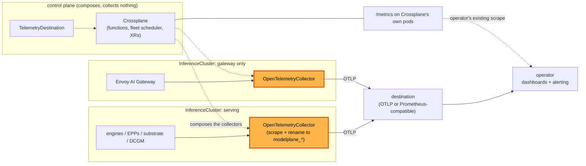

# Metrics collection

**Status:** Draft. The MetricMapping kind is proven and unmerged; the rest is unbuilt
**Date:** August 2026
**Author:** Dennis Ramdass

This document proposes collecting metrics on every cluster, normalizing them to a
`modelplane_*` namespace, and exporting them to one destination where the fleet is a single
view. It builds on [design.md](./design.md) and addresses
[#269](https://github.com/modelplaneai/modelplane/issues/269).

## Summary

**Collect on every cluster.** Modelplane collects from every source it owns, the engines,
the endpoint pickers, and the substrate, with no per-deployment toggle. A fleet with no
destination configured collects nothing. Always-on is affordable: the section on cost and
cardinality works a fleet's telemetry out at about one percent of the GPUs it watches.

**Normalize to `modelplane_*`.** Each engine names its metrics its own way (`vllm:*`,
`sglang:*`). The collector renames them to one Modelplane vocabulary, picked by an
engine-type label, so a dashboard reads Modelplane's names and not each engine's. That
label is Modelplane's to stamp, from a new `engines[].type` on the `ModelDeployment`.

**Aggregate to one view.** Every cluster exports straight to one destination, under one
vocabulary and the same dimensions, so a query there answers across the fleet rather than
per cluster. Modelplane runs no store and routes nothing through the control plane, which
it could not deploy a collector into anyway.

**Collect with OpenTelemetry.** An OpenTelemetry collector replaces the
kube-prometheus-stack `compose-serving-stack` installs today. The OpenTelemetry Operator
runs it, so Modelplane composes one `OpenTelemetryCollector` per cluster. The section below
gives the reasons and what covers each thing that stack did.

Three API changes carry it: a `MetricMapping` kind holding one engine's renames,
`engines[].type` on a `ModelDeployment`, and a cluster-scoped `TelemetryDestination` naming
where telemetry goes, for the fleet or for the clusters its selector matches. Two smaller ones go with them: naming the engine port, in
`compose-model-replica` rather than in an API, and an optional `gpuTelemetry` on
`InferenceCluster`.

Approving this means agreeing that normalization and aggregation are Modelplane's job
rather than the platform team's, that collection is on for every source once a destination
exists, that the collector is OpenTelemetry in place of the Prometheus stack we install
today, and that control-plane health stays with whoever runs the control plane.

## Architecture

Every cluster collects what it runs and exports it outward. Modelplane composes the collectors
and holds the destination; it stores nothing, aggregates nothing, and sits on no path the
telemetry travels.



## What to monitor

**Inference signal (data plane).** The engine's `/metrics`, the EPP's `llm_d_epp_*`, and
Envoy. TTFT, inter-token latency, tokens per second, queue depth, KV-cache occupancy, and
request and error rates per model. It answers "is my model serving well, and is it
saturated?"

**Substrate health.** The stack Modelplane installs on each workload cluster. Is the
gateway up, are cert-manager, the NVIDIA DRA driver, and the multi-node controller
healthy, are GPUs allocatable and gangs forming. "Is the machinery on this cluster
working?" Which components those are now depends on `InferenceCluster.spec.stack`: a
`Standard` cluster runs the LeaderWorkerSet controller, a `Dynamo` one runs Grove, the KAI
Scheduler, and a ModelExpress server.

**Control-plane health.** Modelplane itself. Crossplane reconcile rates and errors,
function latency and panics, the fleet scheduler placing replicas, and XR `Ready`/`Synced`.
"Is the thing I operate working?"

**Fleet roll-up.** Across every cluster and deployment: capacity, GPU allocation,
GPU-hours, and replicas ready against desired.

The first two are collected on each cluster and exported to one destination, where the
fleet roll-up is a query over them. Control-plane health comes from whoever runs the
control plane, since Modelplane has no way to deploy a collector alongside its own
Crossplane. The section on getting the series across names the two paths that already
serve it.

Two audiences read the result and only one of them operates it. A platform team wants the
substrate, the roll-up and the control plane, and that is the destination they already run. A
`ModelDeployment`'s author wants the first category for their own model, which the same series
answer: every one carries `deployment`, `model`, `cluster` and `engine`, so their view is a
filter on a dashboard rather than a separate pipeline. Modelplane runs no second, author-facing
store, and the shipped dashboard is written to filter that way.

Access to it is the platform team's to grant, which is also why an author gets no collection
toggle: they do not own the destination, the cost, or the retention, so a switch on their
resource would govern none of the things that make collection a decision. What an author owns
without asking anyone is on the API, where a `ModelDeployment`'s conditions say whether its
replicas placed and are ready.

## Collect on every cluster

On each cluster Modelplane collects from every source it owns. The switch is one level up
and at the fleet: with no destination configured anywhere, no cluster composes a collector,
because a collector nothing reads is cost with no reader.

**Every cluster means every cluster, including one with no engines on it.** An
`InferenceGateway` can be hosted on an `InferenceCluster` of its own, and a fleet can run
several. Such a cluster serves no model and still answers the questions an operator asks
first: what the fleet was asked for, what it returned, and how long it took.
So the collector is composed per cluster rather than per serving stack, and a gateway-only
cluster gets one with the gateway's Envoy and the substrate as its sources and no engine
scrape at all. A cluster's collector reports what that cluster has.

**A gateway also produces usage records, and they are logs.** An `InferenceGateway` fronts
requests with Envoy, which can write a structured access log line per request carrying the
caller, the service, the endpoint, the served model and the token counts. Those travel the
collector this document composes and land at the same `TelemetryDestination`, which is what
that name is for: the destination is signal-agnostic, and usage records are the first
signal through it that isn't a metric. Their shape belongs to the gateway's own design;
carrying them belongs to this one.

The pieces are already there.

- **The serving label spans every shape.** `modelplane.ai/serving` is on standalone pods,
  LeaderWorkerSet leaders, Grove leader cliques, and both prefill and decode engines,
  since it's the label the InferencePool selects on. One selector on it follows the shape,
  so leader/worker, prefill/decode, and a Dynamo cluster's PodCliqueSets need no special
  casing. The Dynamo work added a fourth workload kind without touching this, which is the
  test this approach had to pass.
- **Modelplane owns the picker.** The EPP is Modelplane's own Deployment, so its metrics
  port and flags are ours to set.

The scrape config carries over as it stands. `compose-serving-stack` scrapes the gateway's
Envoy proxies today through the Prometheus chart's `additionalScrapeConfigs`, which is a
`kubernetes_sd_configs` block. That is the same format the collector's `prometheus`
receiver takes, so the Envoy target moves across verbatim rather than being rewritten.

A cluster-wide selector on `modelplane.ai/serving` covers every engine of every
deployment, so collection is a cluster property rather than something composed per
replica. A second selector covers the endpoint pickers, and a third the substrate
`compose-serving-stack` installs, which is now stack-dependent: the LeaderWorkerSet
controller on a `Standard` cluster, or Grove, the KAI Scheduler and the ModelExpress
server on a `Dynamo` one. The substrate selector follows the stack. The ModelExpress
server goes in it, and where it serves no metrics endpoint its readiness still arrives
through `k8s_cluster`, which is what the substrate question needs from it.

Scrape the engine port by name and not by number, which needs a change first:
`native.py`, `llmd.py`, and `grove.py` all compose `{"containerPort": 8000}` with no
`name`, so the `__meta_kubernetes_pod_container_port_name` relabel has nothing to match.
Naming it is a prerequisite of this design rather than something it can assume.

Name it `http` and not `metrics`, since it is the one serving port rather than a dedicated
metrics one. Going by name at all is for prefill/decode: the decode engine serves on
`_DECODE_ENGINE_PORT` (8001) because the pd-sidecar takes 8000, so matching 8000 by number
scrapes the sidecar. By name, the scrape follows the engine on every pod, on every
backend.

**A `ModelCache` is in scope through `k8s_cluster`.** It reports the hydration Job
(`k8s.job.failed_pods` and friends) and the claim's phase and requested size, which are
optional metrics the collector turns on. A cache that fails to stage shows up with no new
component, and its convergence stays on the API as `Ready` and `Synced`. How full the
volume is comes from `kubeletstats` and arrives with the DaemonSet tier, which matters
less than it sounds: a cache volume is written once and read after, so an undersized one
fails at hydration rather than climbing into trouble later.

**GPU allocation comes from `k8s_cluster`, and the GPU itself comes from DCGM.**
`k8s_cluster` reports allocatable and requested `nvidia.com/gpu`, which is what the
roll-up sums. The hardware underneath needs the DCGM exporter, and the collector scrapes
one wherever it runs.

Utilization is the least of what that buys. Thermal throttling, ECC errors and XID faults
are production failure modes that present as slow inference with healthy-looking engine
metrics, and nothing else in this design catches them. Memory used per device is the other
one, since an engine reports its KV-cache occupancy and not what else is resident. The
serving question stays answered by the engine's own queue depth and cache occupancy.

Installing it is conditional, because two on a node is worse than none. `dcgm-exporter`
runs `nv-hostengine` embedded, and a second host engine alongside an existing one conflicts
rather than stacks: one side stops reporting, or crash-loops. Left unset,
`compose-serving-stack` installs on a cluster Modelplane provisions, where nothing it
installs brings an exporter of its own, and skips an `Existing` one, where a GPU fleet
usually runs the GPU Operator's already. `InferenceCluster.spec.gpuTelemetry`, `Install` or
`Skip`, overrides both, for the provisioned cluster whose operator brought their own and
the `Existing` one that has none. The scrape stays unconditional and collects whichever
exporter is there.

## Normalize to `modelplane_*`

The collector renames each engine's series to a `modelplane_*` surface with a consistent
label set (`engine`, `cluster`, `deployment`, `model`), so a dashboard reads one
vocabulary. Latency matters most. Measure it on P50/P90/P99 rather than the mean. The
distribution is right-skewed, so the mean hides the tail. Keep inference-only separate
from end-to-end.

| `modelplane_*` | vLLM | SGLang | TRT-LLM / Triton |
| --- | --- | --- | --- |
| `time_to_first_token` | `vllm:time_to_first_token_seconds` | `sglang:time_to_first_token_seconds` | derived |
| `inter_token_latency` | `vllm:inter_token_latency_seconds` | `sglang:inter_token_latency_seconds` | derived |
| `time_per_output_token` | `vllm:request_time_per_output_token_seconds` | `sglang:time_per_output_token_seconds` | derived |
| `request_prefill_time` | `vllm:request_prefill_time_seconds` | `sglang:per_stage_req_latency_seconds` | `nv_trt_llm_*` |
| `request_decode_time` | `vllm:request_decode_time_seconds` | per-stage | `nv_trt_llm_*` |
| `e2e_request_latency` | `vllm:e2e_request_latency_seconds` | `sglang:e2e_request_latency_seconds` | `nv_inference_request_duration_us` |
| `requests_waiting` | `vllm:num_requests_waiting` | scheduler waiting | `nv_trt_llm_request_metrics` |
| `requests_running` | `vllm:num_requests_running` | scheduler running | `nv_trt_llm_request_metrics` |
| `request_queue_time` | `vllm:request_queue_time_seconds` | queue latency | derived |
| `kv_cache_usage` | `vllm:kv_cache_usage_perc` | token usage | TRT-LLM KV metrics |
| `prefix_cache_hits` | `vllm:prefix_cache_hits` | cache hit | n/a |
| `prefix_cache_queries` | `vllm:prefix_cache_queries` | cache queries | n/a |
| `input_sequence_tokens` | `vllm:request_prompt_tokens` | prompt tokens | `nv_trt_llm_*` |
| `output_sequence_tokens` | `vllm:request_generation_tokens` | generation tokens | `nv_trt_llm_*` |
| `requests_total{outcome}` | `vllm:request_success_total` | request counters | Triton success/fail |
| `tokens_total{kind}` | `vllm:prompt_tokens_total`, `vllm:generation_tokens_total` | token counters | Triton token counts |

vLLM and SGLang map cleanly. Their names already nearly match, and both align to the
OpenTelemetry set, so those two ship built in. Triton and TensorRT-LLM expose batch-manager
stats rather than native TTFT and ITL histograms, so that column is derived or waiting on
newer TensorRT-LLM metrics. Shipping it as a third built-in would hand the first Triton
user a mapping that doesn't map, so the docs carry it as a `MetricMapping` to write, with
the gaps named. It is the extension point's first real use.

That alignment is worth being exact about, because it decides what `modelplane_*` is for.
The GenAI conventions define three server-side metrics, `gen_ai.server.request.duration`,
`gen_ai.server.time_to_first_token` and `gen_ai.server.time_per_output_token`, alongside
client-side `gen_ai.client.token.usage`. Those are the first rows of the table, and where
an engine emits them they pass through under their standard names, so a backend that reads
the convention needs no mapping at all.

The standard stops at latency and tokens. Everything that answers "why is it slow" sits
outside it: queue depth and queue time, the running and waiting split, KV-cache occupancy,
and prefix-cache hit rate. That is what the normalized surface is for, rather than a
preference for our own names, and where the convention already covers a series we do not
rename it.

Inter-token latency and time per output token stay separate for the same reason. Only TPOT
is in the standard; ITL is the per-token gap a streaming user feels, where TPOT is the
amortized decode rate, so we carry both.

Saturation is where the table earns its keep. Latency says a deployment is unhealthy and
these say why. KV-cache occupancy approaching full forces the scheduler to preempt and
recompute, which arrives as a latency cliff rather than a slope, and queue time separates
"the request waited" from "the model is slow". Prefix-cache hits need `prefix_cache_queries`
as a denominator, which is why both are collected rather than the hit counter alone. vLLM
v1 exposes no preemption counter, so the cliff is inferred from occupancy and queue time
rather than read directly. That is a gap in the engine, not one this design can close.

Under disaggregation the two roles show different health. A prefill worker is watched on
`modelplane_time_to_first_token` and prefill-queue depth. A decode worker is watched on
`modelplane_inter_token_latency` and `modelplane_kv_cache_usage`. A `role={prefill,decode}`
label carries the split, set from the same serving labels. The finer signals are the two
disaggregation bottlenecks, queued prefill tokens and in-flight decode KV tokens, reported
by the engine's scheduler loop.

These series feed more than dashboards. An autoscaler or an SLA planner reads the same
normalized latency, sequence-length, and queue series to size prefill against decode and
hold TTFT and ITL under target. NVIDIA's Dynamo Planner is the reference for such a
consumer. It samples on the order of seconds, faster than a dashboard needs, which sets
the default: 15s for the engine and picker jobs, where queue depth and KV-cache occupancy
move between scrapes and a 30s sample smooths away the burst that caused the incident. The
substrate and `k8s_cluster` jobs stay at 30s, since a controller's health doesn't move that
fast. Both live in the composed scrape config, so they are Modelplane's to set. Surfacing
them is a field this design doesn't add.

## Aggregate to one view

Per-cluster collection is half the ask. Every cluster's series have to land in one place,
under one vocabulary, so one query covers the whole deployment rather than a per-cluster
island an operator stitches together by hand.

### Getting the series across

Modelplane has one connection to a workload cluster it can count on, and it runs the wrong
way for this: the control plane reaches the cluster's API server with the kubeconfig
`provider-kubernetes` holds, and nothing guarantees a path back from an on-premise or
neocloud GPU cluster behind a firewall.

**Every cluster exports to the destination.** Each cluster's collector OTLP-exports
straight to the endpoint the fleet configures, so a cluster needs egress and nothing
inbound.

Credentials are already solved. `ModelCache` propagates an `authSecret` from the control
plane to every matched cluster so hydration can read a HuggingFace token. The destination's
credential travels the same way, so this adds a Secret to propagate rather than a way to
propagate Secrets.

**Nothing routes through the control plane, because nothing can run there.** A collector at
the control plane reads naturally, since the control plane is the thing that knows about
every cluster, and it is the shape to rule out first. A control plane hosts Crossplane and
the API it serves, not workloads, and a hosted one schedules no pods at all, so there is
nowhere to put a collector, a listener or the certificate it would need. It would be the
wrong size anyway: Crossplane reconciles resources rather than carrying a stream that grows
with every engine pod.

**The gateway doesn't rescue it either,** and it is the obvious next thought, since an
`InferenceGateway` is a surface a cluster can already reach. It speaks the inference APIs,
so routing OTLP through it means teaching Envoy a protocol it has no reason to know, to
reach a collector that still has nowhere to run. It also couples telemetry to a component a
fleet might deploy several of, or none of.

**The destination is the operator's, which is the point.** It sits where their observability
already is, inside their network as often as not, so a cluster that can reach their backend
needs no path anywhere else. Exporting direct also removes a hop that can fail and leaves a
cluster's telemetry working while the control plane is upgrading.

**Control-plane health belongs to whoever runs the control plane.** Crossplane's reconcile
rates, function latency and the fleet scheduler's decisions are what an operator wants when
Modelplane itself misbehaves, and the constraint above means Modelplane cannot collect
them. A self-hosted Crossplane serves `/metrics` on its core, provider and function pods
for an operator's existing scrape, and a hosted one reports through whoever hosts it.
Modelplane's part is naming the series worth alerting on, which lands in the docs. Its
reconcile state stays on the API regardless, as `Ready` and `Synced` on every XR, and
[resource-state-metrics](https://github.com/crossplane-contrib/resource-state-metrics)
turns those conditions into series for an operator who wants to alert on them. It is a
Deployment, so it runs where Crossplane does and inherits the same constraint.

That is also why the roll-up counts replicas ready against desired rather than degraded
deployments. Replica state comes from `k8s_cluster` on the workload clusters, where a
deployment's degraded-ness is a condition on an XR the control plane holds. The gap between
them is a deployment the fleet scheduler never placed, which shows on the API and not in
the roll-up.

**Pull direct** stays ruled out: a LoadBalancer or Ingress per cluster needs inbound exposure
on every GPU cluster, which exporting avoids. A cluster that can reach some backend but not the
fleet's is handled by a destination of its own, below. A cluster with no egress at all is out
of scope; if one turns up, a collector on a neighbouring cluster it can reach is a smaller
answer than a mode field on the API.

### What aggregates, and where

With no collector in the middle, the destination aggregates. That is a change of owner
rather than of capability: `sum` across clusters and a histogram merge are what every
Prometheus-compatible backend does, and Modelplane's job is to make them answerable by
naming the series the same way everywhere and stamping the same dimensions on them.

So the `modelplane_*` roll-up is a set of queries Modelplane ships rather than a collector
it runs. Capacity, GPU allocation, GPU-hours and replicas ready against desired are sums
over the fleet. Metering is split, and Modelplane publishes only its half: GPU-hours per
`ModelDeployment`, because it owns the pools, and tokens per request, because the gateway
reads them. It prices neither, which is why cost is absent from this roll-up. SLO
attainment, the fraction of requests under a TTFT target, is a ratio of buckets in the
merged histogram, which works because Modelplane owns the histogram boundaries and puts one
on the target. Modelplane runs no store and now hosts no pipeline either.

Those queries ship as documentation, with a Grafana dashboard built on them, since a
Prometheus-compatible store is the common destination. An operator points it at their
backend rather than writing the fleet math themselves. The one requirement that puts on a
destination is that it sums across clusters and merges histogram buckets, which every OTLP
backend and every Prometheus-compatible store does, so it is the population the two
exporters below already reach.

### Exporters and destination

The exporter contract is OTLP, `otlp` over gRPC or `otlphttp`, taken by any
OpenTelemetry-compatible backend. `prometheusremotewrite` covers an operator who wants the
series in a Prometheus-compatible store instead. Vendor-specific exporters are out of
scope: an operator who wants one puts a collector of their own in front of it, which is one
configuration for the fleet rather than one per cluster, and keeps that dependency out of
every GPU cluster.

A Modelplane user does not write collector YAML. The destination is fleet-level
configuration, one endpoint to match one view, propagated to each cluster's `ServingStack`
and rendered into the collector's config there.

**That configuration is a cluster-scoped `TelemetryDestination`,** and its shape is
borrowed rather than invented. Grafana's Kubernetes monitoring chart calls the same thing a
[destination](https://github.com/grafana/k8s-monitoring-helm/blob/main/charts/k8s-monitoring/docs/destinations/README.md)
and gives it a type, an endpoint and an auth block backed by a Secret, and Crossplane's
`StoreConfig` and every `ProviderConfig` are cluster-scoped with a `credentials.secretRef`.
A kind rather than a field, because nothing fleet-level holds the field: `InferenceCluster`
and `InferenceClass` are each a piece of the fleet, so a field on either stores one fleet
fact N times. Grafana puts destinations in Helm values because it ships a chart, and a
config XRD is how a Crossplane package expresses the same thing. So:

```yaml
apiVersion: modelplane.ai/v1alpha1
kind: TelemetryDestination
metadata:
  name: default
spec:
  type: OTLP                           # OTLP | PrometheusRemoteWrite
  otlp:
    endpoint: otlp.acme.example:4317
    protocol: gRPC                     # gRPC | HTTP
  auth:
    type: Bearer                       # None | Basic | Bearer
    secretRef:
      name: telemetry-destination      # in modelplane-system
```

`type` discriminates with a CEL rule the way `ModelCache.spec.source` does:
`self.type != 'OTLP' || has(self.otlp)`. The variant object earns its place on its first
field, since OTLP is gRPC or HTTP and remote write is neither. `auth.type` starts with the
three that cover most backends, where Grafana's chart also carries `oauth2` and `sigv4`.
The Secret resolves in `modelplane-system`, the way `InferenceCluster` resolves a kubeconfig.

**Reaching it is the other half of the configuration.** The export is one outbound connection
from each cluster's collector to `endpoint`, gRPC on 4317 or HTTP on 4318 by convention, and
nothing on the cluster listens. Two things break that in exactly the networks this shape exists
for. A backend inside an operator's own network is often signed by a private CA the collector
has no reason to trust, and a cluster that egresses through a corporate proxy reaches nothing
until it is told so. Both belong on the destination rather than in a collector config an
operator patches by hand:

```yaml
spec:
  tls:
    caSecretRef:                       # when the backend's CA isn't a public one
      name: telemetry-destination-ca   # in modelplane-system, beside the auth Secret
  proxyURL: http://proxy.acme.example:3128
```

`proxyURL` renders to the standard proxy variables on the collector rather than into one
exporter's settings, so it covers every exporter in the pipeline at once. There is deliberately
no `insecure` flag to skip verification: it is the kind of thing that gets set to reach a
backend during a bring-up and is still set two years later, and naming a CA is the same amount
of typing.

A fleet usually has one, and every cluster exports to it. Where there are several, a
destination says which clusters send to it with an optional `clusterSelector`, the same shape
and the same meaning `ModelCache` already gives that field. Omitting it means every cluster,
which keeps the common case to one object with no selector to write.

```yaml
spec:
  clusterSelector:
    matchLabels:
      modelplane.ai/region: eu
```

**A cluster that cannot reach the fleet destination is the reason that field exists.** The
argument for exporting outward is that a GPU cluster behind a firewall can reach out where
nothing can reach in, and the same reasoning says an operator's backend is not automatically
reachable from every cluster they run. A neocloud with no route to a private network, a region
whose telemetry is not allowed to leave it, a cluster a different team operates: in each the
cluster can export, just not there. Without a selector that cluster collects nothing, which is
the worst of the options, because the failure is silent and the telemetry is exactly what would
explain it.

So a destination is per-cluster by construction and fleet-wide by default. A second destination
with a selector covers the isolated clusters, and a cluster matched by several exports to each,
one exporter per destination in the same pipeline, which is also how an operator moves between
backends without a gap.

The cost is honest and worth stating: a fleet whose clusters export to different backends has
no single place the fleet query runs. That is not something this design can fix, because it is
a property of the network the operator has rather than of the pipeline. What it can do is make
the split deliberate and visible, in a selector someone wrote, rather than a cluster quietly
collecting nothing. Where the split is unwanted, the answer is a collector the isolated cluster
can reach that forwards to the main backend, which is the operator's hop to run and needs
nothing here.

The name is telemetry rather than metrics. An OTLP endpoint carries metrics, logs and
traces on the same wire, so the destination is signal-agnostic and `MetricsDestination`
would describe it narrower than it is. Creating one is the first thing a user does, since
nothing is collected until a destination exists, so it is also the first thing the docs
describe.

### Cost and cardinality

Collection is on for every source with no per-deployment toggle, so the fleet pays for all
of it and the number belongs in this document.

One vLLM 0.23.0 pod publishes 359 metric lines, measured on the GKE run in the appendix. Fifty
engine pods, plus the pickers, Envoy, the substrate, `k8s_cluster` and DCGM, is on the
order of 40,000 series. A managed Prometheus at roughly $6.50 per thousand series a month
at one sample a minute, four times that at the 15s interval above, puts the fleet's
telemetry near $640 a month. Fifty A100s cost between $40,000 and $125,000 a month
depending on where they run. Telemetry is about one percent of the GPUs it watches, which
is what makes always-on collection an easy trade.

That ratio holds because of one decision. A billing backend counts a series as active while
it is still receiving data, for fifteen to thirty minutes after it stops, so every rolling
update mints a fresh set of series per pod that stays billable long after the pod is gone.

Dropped, therefore: `pod`, `pod_uid`, and `container_id`. Kept: `engine`, `cluster`,
`model`, `deployment`, and `namespace`, which are the dimensions the roll-up and every
dashboard query group by. Never added: `caller`. A caller is unbounded by construction, so
every new key would be permanent cardinality, and per-caller token counts are what a usage
record is for. `modelplane_tokens_total` is the engine's count of what it generated; what a
caller was served is a log line. Dropping the churning three in the collector is cheaper than
paying for them downstream and then aggregating them away, and it is the difference between
one percent and a number someone argues about.

The obvious processor is the wrong one. The `attributes` processor's `delete_key` removes a
label but leaves the series that collided on it as separate, undefined points rather than
merging them. Merging within a dropped dimension is `metricstransform` with an aggregation
action, which sums the colliding series into one.
Getting this wrong looks like it worked and reports nonsense.

Histogram buckets are the other cost, and not one to trim. `le` is what makes
the fleet histogram and the SLO ratio above possible, so the buckets stay as the GenAI
conventions define them.

### Logs

A `TelemetryDestination` names a destination rather than a metrics endpoint because the same
pipeline carries the other signals. Logs are the one with a decision attached, so the shape is
recorded here even though metrics land first.

Two kinds travel under the name and they are not alike. Component logs are what the engine, the
gateway and the controllers write to stderr. They earn their place the way they always do: a
metric says a deployment is failing, and the log says the engine could not find the weights.
Reading them is the `filelog` receiver, which is node-scoped, so they arrive with the DaemonSet
tier rather than the first cut. That tier is what node CPU, memory and disk wait for too, and
logs are what make it worth running.

GenAI events are the other kind. The conventions define
`gen_ai.client.inference.operation.details` as a log record carrying the prompt, the completion
and the sampling parameters, correlated back to its span by trace and span id. That is what
makes one slow request inspectable rather than only counted.

It is also the most sensitive thing the pipeline could move, and the largest. A prompt and its
completion are orders of magnitude bigger than a metric sample, and they are user content,
which makes them a consent and retention question before a volume one. So it is off by default
and stays off until an operator turns it on, and this design records the questions rather than
answering them: what consent it needs, how long it may be kept, and whether sampling a share of
requests is enough. Emitting metrics about a request needs none of that, which is why metrics
do not wait on it.

The cardinality argument above does not carry over. A label added to a metric multiplies series
for as long as the series exists; a log record is one record. Logs are priced on volume and
retention instead, so the control that matters is what is captured and how much of it, not
which attributes are dropped before export.

## Collector: OpenTelemetry

The collector is an OpenTelemetry collector, and it replaces the kube-prometheus-stack
`compose-serving-stack` installs. The reasons, over keeping Prometheus:

- **The normalization target is a standard.** The OpenTelemetry GenAI conventions already
  define `time_to_first_token` and `time_per_output_token` as histograms with LLM-shaped
  buckets. `modelplane_*` adopts those names rather than inventing them.
- **The rename happens in the pipeline.** The collector scrapes each engine's `/metrics`
  with the Prometheus receiver and renames the series before forwarding. A Prometheus stack
  pushes that rename into recording rules on every cluster and still needs its own
  federation.
- **One pipeline carries three signals.** Metrics, the #77 traces, and the gateway's usage
  records travel together, where a Prometheus stack is metrics only.

Prometheus looks load-bearing here, since its operator defines the `PodMonitor` CRD, and
the dependency runs the other way. `PodMonitor` is a consequence of having chosen
Prometheus rather than a requirement of collection. The collector's `prometheus` receiver
does Kubernetes service discovery itself, so discovery is a scrape config the collector
carries rather than a CRD per target.

### The OpenTelemetry Operator runs it

`compose-serving-stack` installs the [OpenTelemetry
Operator](https://opentelemetry.io/docs/platforms/kubernetes/operator/) and composes one
`OpenTelemetryCollector` per cluster, rather than composing a Deployment and a ConfigMap by
hand. Modelplane writes that resource; a user never sees it.

The operator earns that. Its admission webhook rejects an invalid collector config on
apply, where a hand-composed ConfigMap reports the same mistake as CrashLoopBackOff after
the fact. It regenerates the ConfigMap and rolls the pods when the
config changes, which a hand-composed pair needs a checksum annotation or a reloader to
match. `mode` is `deployment`, `daemonset` or `statefulset`, so the two tiers below are one
field rather than two hand-written workloads. And the [Target
Allocator](https://opentelemetry.io/docs/platforms/kubernetes/operator/target-allocator/)
is there when one collector stops being enough for a cluster's engines, which wants
`statefulset` or `daemonset` mode and a receiver named exactly `prometheus`.

It costs a Helm release and a CRD on every cluster, in the change that removes
kube-prometheus-stack, which is an operator with a larger CRD set of its own. Its one hard
prerequisite is cert-manager, for the webhook's certificate, and `compose-serving-stack`
already installs cert-manager. Composing an `Object` that waits for a chart's CRD is what
the GatewayClass and the Envoy Gateway already do here. It leaves two things alone: the
operator and the collector image are separate versions to pin, and the ServiceAccount it
creates carries no policy, so the ClusterRole that `k8sattributes` and `k8s_cluster` need
is composed either way.

This adopts an operator for the collector's lifecycle, not for discovery. Targets stay a
scrape config inside the `OpenTelemetryCollector`, so the `PodMonitor` argument above is
unchanged.

### What replaces the stack

Each thing kube-prometheus-stack does today has a receiver that does it.

| Today | Replacement |
|---|---|
| `PodMonitor` discovery | `prometheus` receiver with `kubernetes_sd_configs` |
| The Envoy scrape config | the same block, moved into that receiver |
| kube-state-metrics | `k8s_cluster` receiver |
| cAdvisor and kubelet | `kubeletstats` receiver |
| node-exporter | `hostmetrics` receiver |

That splits the collector in two, which is two `OpenTelemetryCollector` resources
differing by `mode`. Node-scoped receivers (`kubeletstats`, `hostmetrics`, and the
`filelog` receiver when logs follow) need a collector on every node, so they run as a
DaemonSet. Cluster-scoped ones (`k8s_cluster`, and the engine and EPP scrapes) run as one
Deployment. The engine scrape could run in
either; putting it in the Deployment keeps one scrape config rather than N node-local ones.

The Deployment tier ships first and the DaemonSet tier follows. Engines, the EPP, DCGM and
`k8s_cluster` answer the inference and substrate questions above, and every one of them is
a pod scrape. Node CPU, memory and disk answer a question a platform team usually has
another agent for, so a per-node pod on every GPU cluster is worth adding when logs need
that tier anyway.

### What we give up

Ad-hoc PromQL against a local store. Today an operator can port-forward a cluster's
Prometheus and query it. After this there is no per-cluster store, so ad-hoc querying moves
to whatever consumes the export. That is the same trade the roll-up section already makes
for the center, applied to each cluster.

What a fresh install gives you inverts. Today Modelplane installs a working per-cluster
store with no aggregation. After this it aggregates across the fleet and stores nothing, so
an install with no destination configured collects nothing at all. That is the right trade
for a fleet and the wrong one for a first afternoon with Modelplane, so the getting started
guide installs one Prometheus-compatible store on the cluster it creates and points a
`TelemetryDestination` at it. That is a step in a guide rather than a default in the API,
and an operator who already has a backend points the same resource at theirs instead.

## Removing the Prometheus stack

This is the one breaking change here, so it lands last and on its own. The collector, the
destination and the built-in renames go in alongside the existing stack, where an operator
can compare the two and nothing they rely on moves. The API changes follow. The removal
comes after that, because approving a new collector and approving the deletion of the store
people query today are different decisions.

The [#264](https://github.com/modelplaneai/modelplane/issues/264) example documents the
manual path, and it is the published `collecting-engine-metrics` guide. Both halves of that
workflow go: the hand-written `PodMonitor`, because discovery moves into the collector's
scrape config, and the port-forward to the in-cluster Prometheus, because there is no
longer one. The replacement is written already, as the draft `telemetry` guide in this
change, which takes that page's URL when the removal lands. Its rewrite is part of the
removal rather than a follow-up.

A hand-written `PodMonitor` left in place is inert once the Prometheus Operator is gone, so
it stops working rather than double-scraping, which is quieter and worse. An operator
relying on that Prometheus for anything of their own loses it, so the release note has to
say the store is going and where the series go instead.
## Testing

The local two-cluster end-to-end test covers most of this, and it needs no cloud and no
GPU. `nix run .#e2e` already brings up a control-plane cluster and a workload cluster
registered with `source: Existing`, running a mock engine that answers the serving APIs the
way a vLLM server does. Teaching that mock to serve a vLLM-shaped `/metrics` on a port
named `http` turns it into the fixture this design needs.

What that proves is the whole claim: the collector composes on the workload cluster, the
scrape finds the engine by `modelplane.ai/serving` and by port name, a `MetricMapping`
renders into transform rules that rewrite `vllm:*` to `modelplane_*`, and a
`TelemetryDestination` with its Secret propagates from the control plane and exports there.
Pointing the destination at a collector running in the test makes the assertion a query. Two
clusters is also what makes the fleet view testable rather than asserted. Giving that in-test
collector a self-signed certificate covers `tls.caSecretRef` in the same run, which is worth
doing because a trust path nobody exercises is where a private-CA backend fails for the first
user who has one.

What it can't cover: DCGM, which needs GPUs, and which an `Existing` cluster skips by
default anyway; the `kubeletstats` tier; and the fidelity of any real engine's metrics,
which is what #412's GKE run is for.

## Alternatives considered

### A Prometheus stack

Each cluster keeps the kube-prometheus-stack `compose-serving-stack` installs today, with
composed `PodMonitor`s, and remote-writes to a central Prometheus-compatible store. It's
the incumbent, PromQL is standard, and it keeps the local store an operator can query. The
collector wins for the reasons above: the rename happens in the pipeline rather than in
recording rules on every cluster, and metrics, traces and logs travel one path. It also
runs no Prometheus per cluster, where this shape runs one everywhere and needs its own
federation on top. If an operator wants a store the export still reaches a
Prometheus-compatible one, at the center, once.

### Stop at per-cluster collection

Collect on each cluster, leave the rest to the platform team, and publish a Prometheus URL
on the `InferenceCluster` status. That is close to what this design does and differs where
it matters: every cluster exports to one destination under one vocabulary, so the fleet
view is a query someone writes once. Publishing N URLs leaves each operator to find them,
stitch them, and reconcile three engines' metric names by hand.

### Compose the collector's Deployment and ConfigMap directly

No operator, no CRD, and `compose-serving-stack` writes the two objects itself. It is fewer
moving parts on each cluster and it gives up validation on apply, rollout on config change,
and the `mode` field that makes the second tier free. Each of those is something we would
write and then maintain. The operator's own prerequisite, cert-manager, is already in the
stack.

An `OpenTelemetryCollector` also doesn't answer where the fleet sends telemetry. Its
exporters block is per cluster, so `TelemetryDestination` says it once and the composed
resource renders it N times. The two are layers rather than alternatives.

### OpAMP

[OpAMP](https://opentelemetry.io/docs/specs/opamp/) is the standard for configuring a fleet
of collectors from one place, and its agents connect out to the server, which suits the
reachability this design works around. The server is a pod, and the place it belongs is the
control plane, which runs none. It gets interesting the day there is somewhere to run one.

### Raw engine metric names, no normalization

Aggregating the engines' native names (`vllm:*`, `llm_d_epp_*`) as-is is less work, but it
hands an operator a different vocabulary per engine and per component. The `modelplane_*`
surface is the point of aggregating in the first place: one set of names and labels for the
whole deployment.

### Smaller shapes, rejected

A `PodMonitor` per replica from `compose-model-replica` buys nothing over one cluster-wide
scrape config, composes N objects where one does the same job, and assumes the CRD that
goes with the Prometheus stack. An `enabled` toggle on a `ModelDeployment` covers only the
data plane and asks its author to opt in or out of collection the platform team consumes.
The EPP's `/metrics` could sit behind controller-runtime auth, and since Modelplane owns
the EPP args and the endpoint carries routing stats reachable only in-cluster,
`--metrics-endpoint-auth=false` collects them with nothing to manage.

## Appendix

Mechanics the design rests on, kept out of the argument above.

### Capture from an opaque engine

Modelplane doesn't know which engine a deployment runs. The ML team supplies an image and
args, and serving stays opaque to the engine inside. Normalization is the opposite.
`vllm:time_to_first_token_seconds` and `sglang:time_to_first_token_seconds` fold into one
`modelplane_*` series only if something knows which engine produced them. So we need just
enough engine identity to pick a mapping, and no more.

The pattern is the one the [GAIE model-server-protocol](https://github.com/kubernetes-sigs/gateway-api-inference-extension/blob/main/docs/proposals/003-model-server-protocol/README.md)
uses: read a label, don't detect the engine. The GAIE endpoint picker carries metric
mappings for vLLM and SGLang and selects one from an engine-type label on the pod.

No such label exists in Modelplane today, and an ML team can't add one. The
`ModelDeployment` XRD rejects any label key under the reserved `modelplane.ai/` prefix, on
both the deployment and the member pod template, so `modelplane.ai/engine: vllm` fails to
apply. That prefix is Modelplane's to stamp, which is how `modelplane.ai/serving`,
`modelplane.ai/workload` and `modelplane.ai/pool` already reach pods.

So the engine type is a field, and the label is derived from it. An optional `type` on the
engine, naming the engine's kind, which `compose-model-replica` stamps onto the pod as
`modelplane.ai/engine` alongside the labels it already applies. One field feeds two
consumers, the picker for routing and the collector for normalization, and the reserved
prefix keeps meaning what it means.

The picker routes any engine. Its KV- and queue-aware scoring reads the engine's standard
metrics through the same mapping, so an engine without them still routes, only less
informed.

- **A capture contract.** An engine exposes Prometheus `/metrics`. The required set
  follows the GAIE protocol and the OpenTelemetry GenAI conventions: TTFT, time per output
  token, queue depth, KV-cache occupancy. It's the metrics analogue of the OpenAI API
  contract Modelplane already assumes for serving.
- **Selection by a stamped label.** `modelplane.ai/engine` picks the `MetricMapping`.
  `type` is a free-form string validated as a label value rather than an enum, so the
  mappings below stay open to a forked or unreleased engine an enum would lock out. A
  value with no mapping degrades to passthrough.
- **An extension point, not a registry.** The built-in mappings live in
  `compose-serving-stack` as code, since a Crossplane configuration package ships XRDs and
  compositions rather than instances, and a composition can't apply one to the control
  plane it runs on. `MetricMapping` is what a platform team adds for an engine Modelplane
  doesn't ship, and a mapping selecting an engine already built in replaces it. Being
  typed, it validates on apply and lists under `kubectl get metricmappings`, and adding one
  is no fork and no Modelplane release.
- **Graceful degradation.** An unlabelled or unmapped engine still gets scraped and
  aggregated under its own names. The rename is skipped and Modelplane surfaces it
  ("no mapping for `X`") rather than guessing a mapping and reporting the wrong thing.
  Passthrough keeps the name and not the punctuation: the collector's Prometheus exporter
  sanitizes `:` to `_`, so an unmapped `vllm:kv_cache_usage_perc` arrives as
  `vllm_kv_cache_usage_perc`. Measured, not assumed.

Selecting by label rather than by metric name looks redundant at first, since engine
metric names are already namespaced (`vllm:`, `sglang:`) and a flat name-to-name map would
rename them unambiguously. The label carries what a name cannot: which engine a pod claims
to run, so "no mapping for `X`" is distinguishable from a rename that matched nothing; the
per-pod labels a mapping attaches to series it does not rename; and a forked engine, which
emits the upstream names while needing its own mapping. Scheduler names are plain
`scheduler_*` with no namespace at all.

In collector terms that makes the rename an OTTL transform gated on a resource attribute,
rather than the simpler metrics-transform processor, which matches on metric name only.
The pod label reaches OTTL as a resource attribute through the k8sattributes processor.

A `MetricMapping` is small: a selector for the pods it applies to, the source names, the
`modelplane_*` name each becomes, and the labels to keep or add. The vLLM one:

```yaml
apiVersion: modelplane.ai/v1alpha1
kind: MetricMapping
metadata:
  name: vllm
spec:
  selector:
    matchLabels:
      modelplane.ai/engine: vllm      # stamped by Modelplane from engines[].type
  rename:
    vllm:time_to_first_token_seconds: modelplane_time_to_first_token
    vllm:inter_token_latency_seconds: modelplane_inter_token_latency
    vllm:num_requests_waiting: modelplane_requests_waiting
    vllm:kv_cache_usage_perc: modelplane_kv_cache_usage
  labels:
    add: { engine: vllm }
```

`compose-serving-stack` reads every `MetricMapping` as a required resource, the same way
`compose-model-deployment` reads `InferenceCluster` and `ModelCache`. It renders them into
the collector's config, which is the `config` block of the `OpenTelemetryCollector`
composed on each cluster. The `rename` map becomes transform-processor rules, applied to
metrics from the pods the `selector` matches. A new engine is a new `MetricMapping`, not
a package change.

What that renders, with the vLLM mapping above as the only one installed:

```yaml
receivers:
  prometheus:
    config:
      scrape_configs:
      - job_name: modelplane-engines
        kubernetes_sd_configs: [{ role: pod }]
        relabel_configs:
        # every engine of every deployment, whatever its workload kind
        - source_labels: [__meta_kubernetes_pod_label_modelplane_ai_serving]
          action: keep
          regex: .+
        # the engine's own port, not a sidecar's
        - source_labels: [__meta_kubernetes_pod_container_port_name]
          action: keep
          regex: http

processors:
  # lifts the stamped engine label onto the series as a resource attribute
  k8sattributes:
    extract:
      labels:
      - { tag_name: engine, key: modelplane.ai/engine, from: pod }

  # one block per MetricMapping, gated on the engine it selects
  transform/vllm:
    metric_statements:
    - context: metric
      conditions:
      - resource.attributes["engine"] == "vllm"
      statements:                           # one per rename entry
      - set(name, "modelplane_time_to_first_token")
          where name == "vllm:time_to_first_token_seconds"
      - set(name, "modelplane_kv_cache_usage")
          where name == "vllm:kv_cache_usage_perc"

exporters:
  otlp:
    endpoint: ${MODELPLANE_OTLP_ENDPOINT}
    auth: { authenticator: bearertokenauth }
```

An unmapped engine matches the scrape config and no `transform` block, so it arrives under
its own names. That is the degradation above, and the structure gives it rather than a
rule having to.

All of this was built and run in
[#412](https://github.com/modelplaneai/modelplane/pull/412), on a GKE cluster with vLLM
0.23.0 and its 359 metric lines: the mapped ones came back renamed in place and labelled
with their engine, and the remaining 308 passed through. That PR is closed unmerged waiting
on this design, and the branch `dennis/metrics-poc` stays. The EPP half is unbuilt, since
the endpoint picker exposes no metrics port today.

As engines emit the OpenTelemetry conventions directly (vLLM already emits OTLP traces,
and native OTLP metrics are in progress), each mapping shrinks toward identity and the
label becomes optional.

### Cluster scheduler metrics

The engine is not the only pluggable component on a workload cluster. The pod scheduler
that places the engine pods is one too. By default it is kube-scheduler, which on a managed
cluster sits in the provider's control plane and is often not scrapable.

A gang scheduler runs as in-cluster pods the collector reaches, and on a `Dynamo` cluster
Modelplane now installs one itself. `compose-serving-stack` composes the KAI Scheduler and
the queues its pods schedule against, so KAI's series are first-party rather than something
a platform team might have brought: the queue is `modelplane` under an unbounded
`modelplane-root`, and every Grove pod carries `kai.scheduler/queue: modelplane`.

Modelplane treats a scheduler like an engine. A per-scheduler mapping, keyed by the one
installed, normalizes to a `modelplane_cluster_scheduler_*` surface. The name says cluster
because a future Modelplane fleet scheduler, placing replicas across clusters rather than
pods across nodes, would get its own `modelplane_fleet_scheduler_*` surface.

The signals are waiting work, scheduling latency, gang readiness, per-queue GPU
allocation against quota, and preemptions. KAI publishes all five, `kai_queue_*` for the
queue-shaped ones, which answers whether a replica's pods reach GPUs and whether a
cluster's capacity is shared fairly across teams.

Gang readiness has to come from the scheduler rather than from Grove.
`PodCliqueSet.status.podGangStatuses` exists on the type and nothing writes it, so
`availableReplicas` is all Grove publishes, and it can't tell a gang that never formed from
one still forming.

A scheduler's mapping is a `MetricMapping` like an engine's, and the degradation rule
carries over, punctuation caveat included. A fleet that brought Volcano writes one mapping,
which is the mechanism working rather than a new problem.

