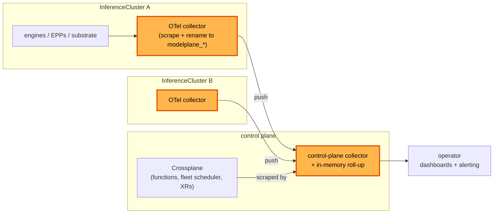

# Metrics collection

**Status:** Draft, with the MetricMapping kind proven and unmerged
**Date:** August 2026
**Author:** Dennis Ramdass

This document proposes collecting metrics on every cluster, normalizing them to a
`modelplane_*` namespace, and aggregating them up to one Modelplane view at the control
plane. It builds on [design.md](./design.md) and addresses
[#269](https://github.com/modelplaneai/modelplane/issues/269).

## Summary

I propose four things.

**Collect on every cluster, always on.** Modelplane collects from every source it owns,
the engines, the endpoint pickers, and the substrate, with no per-deployment toggle.

**Normalize to `modelplane_*`.** Each engine names its metrics its own way (`vllm:*`,
`sglang:*`). The collector renames them to one Modelplane vocabulary, picked by an
engine-type label, so a dashboard reads Modelplane's names and not each engine's. That
label is Modelplane's to stamp, from a new `engines[].type` on the `ModelDeployment`.

**Aggregate to one view.** Every cluster's series roll up to one view at the control
plane, so one query covers the whole deployment instead of a per-cluster island.

**Collect with OpenTelemetry.** The collector is an OpenTelemetry collector, added beside
the per-cluster Prometheus rather than replacing it. The section below gives the reasons.

Two API additions carry it: a `MetricMapping` kind holding one engine's renames, and
`engines[].type` on a `ModelDeployment`. Naming the engine port is a third change, to
`compose-model-replica` rather than to an API.

Approving this means agreeing that normalization and aggregation are Modelplane's job
rather than the platform team's, that collection is always on, and that the collector is
OpenTelemetry.

## What to monitor

Four things are worth watching in a Modelplane deployment.

**Inference signal (data plane).** The engine's `/metrics`, the EPP's `llm_d_epp_*`, and
Envoy. TTFT, inter-token latency, tokens per second, queue depth, KV-cache occupancy, and
request and error rates per model. It answers "is my model serving well, and is it
saturated?"

**Substrate health.** The stack Modelplane installs on each workload cluster. Is the
gateway up, are cert-manager, the NVIDIA DRA driver, and the multi-node controller
healthy, are GPUs allocatable and gangs forming. "Is the machinery on this cluster
working?" Which components those are now depends on `InferenceCluster.spec.stack`: a
`Standard` cluster runs the LeaderWorkerSet controller, a `Dynamo` one runs Grove, the KAI
Scheduler, and a ModelExpress server.

**Control-plane health.** Modelplane itself. Crossplane reconcile rates and errors,
function latency and panics, the fleet scheduler placing replicas, and XR `Ready`/`Synced`.
"Is the thing I operate working?"

**Fleet roll-up.** Across every cluster and deployment: total capacity, GPU usage,
degraded deployments, and cost.

All four are in the central view. The data plane and substrate are collected on each
cluster and aggregated up, the control plane is scraped at the center, and the fleet
roll-up is the collector's aggregation over the collected series.

## Collect on every cluster

On each cluster Modelplane collects from every source it owns, with no opt-in or opt-out.
Three existing pieces make it cheap.

- **The serving label spans every shape.** `modelplane.ai/serving` is on standalone pods,
  LeaderWorkerSet leaders, Grove leader cliques, and both prefill and decode engines,
  since it's the label the InferencePool selects on. One selector on it follows the shape,
  so leader/worker, prefill/decode, and a Dynamo cluster's PodCliqueSets need no special
  casing. The Dynamo work added a fourth workload kind without touching this, which is the
  test this approach had to pass.
- **The stack already scrapes.** `compose-serving-stack` runs a metrics stack on every
  workload cluster and already scrapes the gateway's Envoy proxies, so adding a target is
  composition, not new infrastructure.
- **Modelplane owns the picker.** The EPP is Modelplane's own Deployment, so its metrics
  port and flags are ours to set.

A cluster-wide selector on `modelplane.ai/serving` covers every engine of every
deployment, so collection is a cluster property rather than something composed per
replica. A second selector covers the endpoint pickers, and a third the substrate
`compose-serving-stack` installs, which is now stack-dependent: the LeaderWorkerSet
controller on a `Standard` cluster, or Grove, the KAI Scheduler and the ModelExpress
server on a `Dynamo` one. The substrate selector has to follow the stack, and the
ModelExpress server is a Modelplane-owned component we have not yet checked for a metrics
endpoint.

Scrape the engine port by name, not by number, which needs a change first: no backend
names it today. `native.py`, `llmd.py`, and `grove.py` all compose
`{"containerPort": 8000}` with no `name`, so a `PodMonitor` matching `port: http` matches
nothing. Naming it is a prerequisite of this design rather than something it can assume.

Name it `http` and not `metrics`, because it is the one serving port rather than a
dedicated metrics one. The reason to go by name at all is prefill/decode: the decode
engine serves on `_DECODE_ENGINE_PORT` (8001) because the pd-sidecar takes 8000, so
matching 8000 by number scrapes the sidecar. By name, the scrape follows the engine on
every pod, on every backend.

## Capture from an opaque engine

Modelplane doesn't know which engine a deployment runs. The ML team supplies an image and
args, and serving stays opaque to the engine inside. Normalization is the opposite.
`vllm:time_to_first_token_seconds` and `sglang:time_to_first_token_seconds` fold into one
`modelplane_*` series only if something knows which engine produced them. So we need just
enough engine identity to pick a mapping, and no more.

The pattern is the one the [GAIE model-server-protocol](https://github.com/kubernetes-sigs/gateway-api-inference-extension/blob/main/docs/proposals/003-model-server-protocol/README.md)
uses: read a label, don't detect the engine. The GAIE endpoint picker carries metric
mappings for vLLM and SGLang and selects one from an engine-type label on the pod.

No such label exists in Modelplane today, and an ML team can't add one. The
`ModelDeployment` XRD rejects any label key under the reserved `modelplane.ai/` prefix, on
both the deployment and the member pod template, so `modelplane.ai/engine: vllm` fails to
apply. That prefix is Modelplane's to stamp, which is how `modelplane.ai/serving`,
`modelplane.ai/workload` and `modelplane.ai/pool` already reach pods.

So the engine type is a field, and the label is derived from it. An optional `type` on the
engine, an enum of the kinds Modelplane ships a mapping for, which
`compose-model-replica` stamps onto the pod as `modelplane.ai/engine` alongside the labels
it already applies. One field feeds two consumers, the picker for routing and the collector
for normalization, and the reserved prefix keeps meaning what it means.
The picker routes any engine. Its KV- and queue-aware scoring reads the engine's standard
metrics through the same mapping, so an engine without them still routes, only less
informed.

- **A capture contract.** An engine exposes Prometheus `/metrics`. The required set
  follows the GAIE protocol and the OpenTelemetry GenAI conventions: TTFT, time per output
  token, queue depth, KV-cache occupancy. It's the metrics analogue of the OpenAI API
  contract Modelplane already assumes for serving.
- **Selection by a stamped label.** `ModelDeployment` gains `engines[].type`, and
  Modelplane stamps `modelplane.ai/engine` from it. That label picks the `MetricMapping`.
  The ML team already chose the engine in the image, so naming its kind is one enum value
  and touches nothing about serving. Typed rather than free-form, it validates on apply
  and a mapping can't be selected by a value nothing produces.
- **A registry of first-class resources.** Each mapping is a `MetricMapping`, a Modelplane
  kind, not a ConfigMap or an EnvironmentConfig. Modelplane installs the built-in ones
  (vLLM, SGLang, Triton/TensorRT-LLM). A platform team applies one more for a new or forked
  engine. Being typed, it validates on apply and appears under `kubectl get metricmappings`,
  and adding one is no fork and no Modelplane release.
- **Graceful degradation.** An unlabelled or unmapped engine still gets scraped and
  aggregated under its own names. The rename is skipped and Modelplane surfaces it
  ("no mapping for `X`") rather than guessing a mapping and reporting the wrong thing.
  One caveat, measured rather than assumed: the collector's Prometheus exporter
  sanitizes `:` to `_`, so an unmapped `vllm:gpu_cache_usage_perc` is published as
  `vllm_gpu_cache_usage_perc`. Passthrough keeps the name and not the punctuation.

Selecting by label rather than by metric name looks redundant at first, because engine
metric names are already namespaced (`vllm:`, `sglang:`) and a flat name-to-name map would
rename them unambiguously with no selector at all. It is not redundant, for four reasons
worth writing down so the field is not optimized away later. Degradation above is
label-based by construction: reporting "no mapping for `X`" means reading a pod's claimed
engine and finding no mapping for it. Name matching cannot tell that apart from a
successful rename of nothing. The consistent label set is per pod, not per series, so name matching
cannot attach `engine` and `cluster` to the series a mapping does not rename. A forked
engine emits the upstream names while needing its own mapping, and two mappings matching
one name cannot be told apart without the pod. And not every name is namespaced:
kube-scheduler's are plain `scheduler_*`, so the scheduler section needs the selector
most of all.

In collector terms that makes the rename an OTTL transform gated on a resource attribute,
rather than the simpler metrics-transform processor, which matches on metric name only. The pod label reaches OTTL as a resource attribute through the k8sattributes
processor.

A `MetricMapping` is small: a selector for the pods it applies to, the source names, the
`modelplane_*` name each becomes, and the labels to keep or add. The vLLM one:

```yaml
apiVersion: modelplane.ai/v1alpha1
kind: MetricMapping
metadata:
  name: vllm
spec:
  selector:
    matchLabels:
      modelplane.ai/engine: vllm      # stamped by Modelplane from engines[].type
  rename:
    vllm:time_to_first_token_seconds: modelplane_time_to_first_token
    vllm:inter_token_latency_seconds: modelplane_time_per_output_token
    vllm:num_requests_waiting: modelplane_requests_waiting
    vllm:gpu_cache_usage_perc: modelplane_kv_cache_utilization
  labels:
    add: { engine: vllm }
```

`compose-serving-stack` reads every `MetricMapping` as a required resource, the same way
`compose-model-deployment` reads `InferenceCluster` and `ModelCache`. It renders them into
the collector's config, the ConfigMap the OTel collector loads on each cluster. The
`rename` map becomes transform-processor rules, applied to metrics from the pods the
`selector` matches. A new engine is a new `MetricMapping`, not a package change.

The kind and the collector that consumes it were built in
[#412](https://github.com/modelplaneai/modelplane/pull/412): `compose-serving-stack` reads
every `MetricMapping` and renders it into the collector's transform rules, each gated on
the engine the mapping selects. That PR is closed unmerged, waiting on this design, and
the branch `dennis/metrics-poc` stays.

That was validated on a real GKE cluster with vLLM 0.23.0, which publishes 359 metric
lines. The mapped ones came back renamed and labelled with their engine, the rename
happening in place rather than alongside the originals, and the remaining 308 passed
through. The EPP half of this document is still unimplemented: the endpoint picker
exposes no metrics port today.

As engines emit the OpenTelemetry conventions directly (vLLM already emits OTLP traces,
and native OTLP metrics are in progress), each mapping shrinks toward identity and the
label becomes optional.

## Normalize to `modelplane_*`

The collector renames each engine's series to a `modelplane_*` surface with a consistent
label set (`engine`, `cluster`, `deployment`, `model`), so a dashboard reads one
vocabulary. Latency matters most. Measure it on P50/P90/P99 rather than the mean. The
distribution is right-skewed, so the mean hides the tail. Keep inference-only separate
from end-to-end.

| `modelplane_*` | vLLM | SGLang | TRT-LLM / Triton |
| --- | --- | --- | --- |
| `time_to_first_token` | `vllm:time_to_first_token_seconds` | `sglang:time_to_first_token_seconds` | derived |
| `inter_token_latency` | `vllm:inter_token_latency_seconds` | `sglang:inter_token_latency_seconds` | derived |
| `time_per_output_token` | `vllm:time_per_output_token_seconds` | `sglang:time_per_output_token_seconds` | derived |
| `request_prefill_time` | `vllm:request_prefill_time_seconds` | `sglang:per_stage_req_latency_seconds` | `nv_trt_llm_*` |
| `request_decode_time` | `vllm:request_decode_time_seconds` | per-stage | `nv_trt_llm_*` |
| `e2e_request_latency` | `vllm:e2e_request_latency_seconds` | `sglang:e2e_request_latency_seconds` | `nv_inference_request_duration_us` |
| `requests_waiting` | `vllm:num_requests_waiting` | scheduler waiting | `nv_trt_llm_request_metrics` |
| `kv_cache_usage` | `vllm:kv_cache_usage_perc` | token usage | TRT-LLM KV metrics |
| `prefix_cache_hits` | `vllm:prefix_cache_hits` | cache hit | n/a |
| `input_sequence_tokens` | `vllm:request_prompt_tokens` | prompt tokens | `nv_trt_llm_*` |
| `output_sequence_tokens` | `vllm:request_generation_tokens` | generation tokens | `nv_trt_llm_*` |
| `requests_total{outcome}` | `vllm:request_success_total` | request counters | Triton success/fail |
| `tokens_total{kind}` | `vllm:prompt_tokens_total`, `vllm:generation_tokens_total` | token counters | Triton token counts |

vLLM and SGLang map cleanly. Their names already nearly match, and both align to the
OpenTelemetry set. Triton and TensorRT-LLM expose batch-manager stats rather than native
TTFT and ITL histograms, so those rows are derived or wait on newer TensorRT-LLM metrics.
That gap is stated, not hidden.

Inter-token latency and time per output token stay separate. ITL is the per-token gap a
streaming user feels. TPOT is the amortized decode rate. Only TPOT is in the OpenTelemetry
set, so we carry both.

Under disaggregation the two roles show different health. A prefill worker is watched on
`modelplane_time_to_first_token` and prefill-queue depth. A decode worker is watched on
`modelplane_inter_token_latency` and `modelplane_kv_cache_usage`. A `role={prefill,decode}`
label carries the split, set from the same serving labels. The finer signals are the two
disaggregation bottlenecks, queued prefill tokens and in-flight decode KV tokens, reported
by the engine's scheduler loop.

These series feed more than dashboards. An autoscaler or an SLA planner reads the same
normalized latency, sequence-length, and queue series to size prefill against decode and
hold TTFT and ITL under target. NVIDIA's Dynamo Planner is the reference for such a
consumer. It samples on the order of seconds, faster than a dashboard needs, so the scrape
interval is a knob rather than a fixed value.

## Cluster scheduler metrics

The engine is not the only pluggable component on a workload cluster. The pod scheduler
that places the engine pods is one too. By default it is kube-scheduler, which on a managed
cluster sits in the provider's control plane and is often not scrapable.

A gang scheduler runs as in-cluster pods the collector reaches, and on a `Dynamo` cluster
Modelplane now installs one itself. `compose-serving-stack` composes the KAI Scheduler and
the queues its pods schedule against, so KAI's series are first-party rather than something
a platform team might have brought: the queue is `modelplane` under an unbounded
`modelplane-root`, and every Grove pod carries `kai.scheduler/queue: modelplane`. A fleet
that brought Volcano itself is the same problem one mapping further out.

Modelplane treats a scheduler like an engine. A per-scheduler mapping, keyed by the one
installed, normalizes to a `modelplane_cluster_scheduler_*` surface. The name says cluster
because a future Modelplane fleet scheduler, placing replicas across clusters rather than
pods across nodes, would get its own `modelplane_fleet_scheduler_*` surface.

Five signals matter, and they answer whether a replica's pods reach GPUs and whether the
cluster's capacity is shared fairly across teams.

- **Pending or unschedulable work.** kube-scheduler's `scheduler_pending_pods{queue}`,
  Volcano's `volcano_unschedule_job_counts`, a KAI queue's waiting podgroups.
- **Scheduling latency.** `scheduler_scheduling_attempt_duration_seconds`,
  `volcano_e2e_job_scheduling_latency_milliseconds`.
- **Gang readiness.** Whether a podgroup's pods can all start at once,
  `volcano_queue_pod_group_pending_count` against `_running_count`. A gang that never forms
  is a stuck multi-node deployment. On a Dynamo cluster this has to come from KAI, not from
  Grove: `PodCliqueSet.status.podGangStatuses` exists on the type and nothing writes it, so
  `availableReplicas` is the only signal Grove publishes, and it can't distinguish a gang
  that never formed from one still forming.
- **Per-queue GPU allocation against quota.** `kai_queue_allocated_gpus`, Volcano's
  `volcano_queue_allocated_scalar_resources` against `_deserved_` and `_capacity_`, with
  `volcano_queue_overused` for fairness.
- **Preemptions and evictions.** `scheduler_preemption_victims`,
  `volcano_pod_preemption_victims`.

A scheduler's mapping is a `MetricMapping` like an engine's, and the degradation rule
carries over, punctuation caveat included. An unmapped scheduler still gets scraped
under its own names, and Modelplane surfaces that rather than guessing.

## Aggregate to one view

Per-cluster collection is half the ask. Each cluster's collector sends its series up to the
control plane, which also collects the control plane's own metrics (Crossplane, the
functions, the fleet scheduler). One query then covers the whole deployment rather than a
per-cluster island an operator stitches together by hand.

The cluster sends by pushing outbound. Each collector remote-writes or OTLP-exports to a
control-plane endpoint, so the workload cluster needs only egress, which is what makes it
work across regions and through firewalls. Nothing inbound to the cluster is required, and
nothing is exposed outside it. The center can pull instead where it already reaches the
cluster, publishing the cluster's endpoint on the `InferenceCluster` status, but push is the
default for the regional and firewalled case.

The roll-up is a set of `modelplane_*` series over the aggregate: capacity, GPU usage,
cost, degraded deployments, and SLO attainment such as the fraction of requests under a
TTFT target. The control-plane collector produces them in memory, because each is a spatial
aggregation it already does. It sums gauges and counters across clusters and merges
per-cluster histograms into a fleet histogram. SLO attainment is a ratio of buckets in
that merged histogram when a boundary sits at the target, which is ours to set. So Modelplane
runs no store and the control plane stays stateless, which is what lets it run in a Space.

Computing a percentile value or answering an ad-hoc query is read-time work for whatever
consumes the export, a dashboard or an operator's own Prometheus-compatible backend.

## Collector: OpenTelemetry

The collector is an OpenTelemetry collector. Three reasons settle it over a per-cluster
Prometheus.

- **The normalization target is a standard.** The OpenTelemetry GenAI conventions already
  define `time_to_first_token` and `time_per_output_token` as histograms with LLM-shaped
  buckets. `modelplane_*` adopts those names rather than inventing them.
- **The rename happens in the pipeline.** The collector scrapes each engine's `/metrics`
  with the Prometheus receiver. The transform processor renames the series to
  `modelplane_*`, keyed by the engine label, before forwarding up. A Prometheus stack
  pushes that rename into recording rules on every cluster and still needs its own
  federation.
- **One pipeline carries three signals.** Metrics, the #77 traces, and logs travel
  together, where a Prometheus stack is metrics only.

The kube-prometheus-stack `compose-serving-stack` installs stays. It is unconditional
today, on both stacks, and two things here depend on it: it already scrapes the substrate
and the gateway's Envoy proxies, and its operator is what defines the `PodMonitor` CRD this
design composes against. So the collector is added beside it rather than in place of it,
and what the collector removes is per-cluster recording rules and a second Prometheus at
the center, not the one already on each cluster.

That leaves one thing to settle: a plain OTel collector doesn't read `PodMonitor`s. Either
it runs under the OpenTelemetry Operator, whose target allocator consumes `PodMonitor` and
`ServiceMonitor` directly and keeps the cluster-wide-selector shape below, or it carries
its own Kubernetes service-discovery scrape config and `PodMonitor` is the wrong word
throughout this document. The target allocator is the smaller change and preserves the
#264 upgrade path, but nobody has run it here, so it is a decision this design records
rather than one it has tested.

## Architecture



## Alternatives considered

### A Prometheus stack

Each cluster runs the kube-prometheus-stack `compose-serving-stack` already installs, with
composed `PodMonitor`s, and remote-writes to a central Prometheus-compatible store. It's
the incumbent and PromQL is standard. The collector wins for the reasons above: it renames
in the pipeline instead of through per-cluster recording rules, and carries traces and logs
on the same path. It does not remove the per-cluster Prometheus, which stays for the
substrate and for its `PodMonitor` CRD; what it avoids is recording rules on every cluster
and a second Prometheus at the center. If an operator does want a store, it can still be
Prometheus-compatible.

### Stop at per-cluster collection

An earlier shape collected on each cluster and left aggregation to the platform team,
publishing a Prometheus URL on the `InferenceCluster` status. Aggregating up to a
Modelplane view is the actual ask, so leaving it out means everyone rebuilds the same
fleet view by hand. Per-cluster collection stays, but as the bottom half of the pipeline,
not the whole of it.

### Raw engine metric names, no normalization

Aggregating the engines' native names (`vllm:*`, `llm_d_epp_*`) as-is is less work, but it
hands an operator a different vocabulary per engine and per component. The `modelplane_*`
surface is the point of aggregating in the first place: one set of names and labels for the
whole deployment.

### A PodMonitor per replica

`compose-model-replica` could compose a `PodMonitor` per replica, so collection comes and
goes with the deployment. With no opt-out and a cluster-wide collector, that per-deployment
lifecycle buys nothing over one cluster-wide selector, and it composes N monitors where one
does the same job.

### A per-deployment opt-out field

An earlier shape put an `enabled` toggle on the deployment. It covers only the data plane
and asks an MD author to opt in or out of collection the platform team consumes. Always-on
collection fits the ownership better, so the toggle is dropped.

### Authenticate the EPP metrics endpoint

The EPP can serve `/metrics` behind controller-runtime auth (a `ClusterRole` with
`nonResourceURLs: /metrics` plus a bearer token). Since Modelplane owns the EPP args and
the endpoint carries non-sensitive routing stats reachable only in-cluster,
`--metrics-endpoint-auth=false` collects them with nothing to manage. Auth would add a
`ClusterRole` and a bearer token for no gain here.

## Interaction with #264

The [#264](https://github.com/modelplaneai/modelplane/issues/264) example documents the
manual path: a hand-written `PodMonitor` plus the operator wiring to consume it. Once
collection is composed and aggregated, that example drops the hand-written
`podmonitor.yaml`.

On upgrade, an existing hand-written `PodMonitor` has to be deleted, or it double-scrapes
the same pods alongside the composed one. This warrants a release note.
