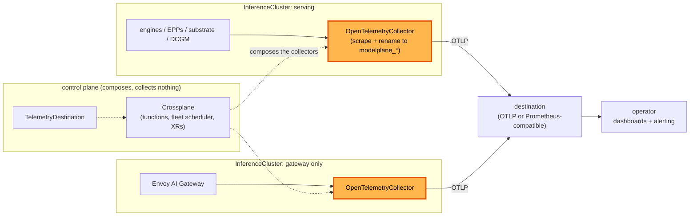

# Metrics collection

**Status:** Draft. The MetricMapping kind is proven and unmerged; the rest is unbuilt
**Date:** August 2026
**Author:** Dennis Ramdass

This document proposes collecting metrics on every cluster, normalizing them to a
`modelplane_*` namespace, and exporting them to one destination where the fleet is a single
view. It builds on [design.md](./design.md) and addresses
[#269](https://github.com/modelplaneai/modelplane/issues/269).

## Summary

**Collect on every cluster.** Modelplane collects from every source it owns, the engines,
the endpoint pickers, and the substrate, with no per-deployment toggle. A fleet with no
destination configured collects nothing.

**Normalize to `modelplane_*`.** Each engine names its metrics its own way (`vllm:*`,
`sglang:*`). The collector renames them to one Modelplane vocabulary, picked by an
engine-type label, so a dashboard reads Modelplane's names and not each engine's. That
label is Modelplane's to stamp, from a new `engines[].type` on the `ModelDeployment`.

**Aggregate to one view.** Every cluster exports straight to one destination, under one
vocabulary and the same dimensions, so a query there answers across the fleet rather than
per cluster. Modelplane runs no store and routes nothing through the control plane, which
it could not deploy a collector into anyway.

**Collect with OpenTelemetry.** An OpenTelemetry collector replaces the
kube-prometheus-stack `compose-serving-stack` installs today. The OpenTelemetry Operator
runs it, so Modelplane composes one `OpenTelemetryCollector` per cluster. The section below
gives the reasons and what covers each thing that stack did.

Three API changes carry it: a `MetricMapping` kind holding one engine's renames,
`engines[].type` on a `ModelDeployment`, and a cluster-scoped `TelemetryDestination` naming
where the fleet's telemetry goes. Naming the engine port is a fourth change, to
`compose-model-replica` rather than to an API.

Approving this means agreeing that normalization and aggregation are Modelplane's job
rather than the platform team's, that collection is on for every source once a destination
exists, that the collector is OpenTelemetry in place of the Prometheus stack we install
today, and that control-plane health stays with whoever runs the control plane.

## What to monitor

**Inference signal (data plane).** The engine's `/metrics`, the EPP's `llm_d_epp_*`, and
Envoy. TTFT, inter-token latency, tokens per second, queue depth, KV-cache occupancy, and
request and error rates per model. It answers "is my model serving well, and is it
saturated?"

**Substrate health.** The stack Modelplane installs on each workload cluster. Is the
gateway up, are cert-manager, the NVIDIA DRA driver, and the multi-node controller
healthy, are GPUs allocatable and gangs forming. "Is the machinery on this cluster
working?" Which components those are now depends on `InferenceCluster.spec.stack`: a
`Standard` cluster runs the LeaderWorkerSet controller, a `Dynamo` one runs Grove, the KAI
Scheduler, and a ModelExpress server.

**Control-plane health.** Modelplane itself. Crossplane reconcile rates and errors,
function latency and panics, the fleet scheduler placing replicas, and XR `Ready`/`Synced`.
"Is the thing I operate working?"

**Fleet roll-up.** Across every cluster and deployment: total capacity, GPU usage,
degraded deployments, and cost.

The first two are collected on each cluster and exported to one destination, where the
fleet roll-up is a query over them. Control-plane health comes from whoever runs the
control plane, since Modelplane has no way to deploy a collector alongside its own
Crossplane. The section on getting the series across names the two paths that already
serve it.

## Collect on every cluster

On each cluster Modelplane collects from every source it owns, with no per-deployment
opt-in or opt-out. The switch is one level up, and at the fleet: with no destination
configured anywhere, no cluster composes a collector, because a collector nothing reads is
cost with no reader. The gate is the fleet destination rather than anything per cluster,
since one destination is what makes the fleet's series one view.

Once a destination exists, collection is on for everything Modelplane owns, and a
`ModelDeployment` author doesn't get a toggle over telemetry the platform team consumes.

**Every cluster means every cluster, including one with no engines on it.** An
`InferenceGateway` can be hosted on an `InferenceCluster` of its own, and a fleet can run
several. Such a cluster serves no model and still answers the questions an operator asks
first: what the fleet was asked for, what it returned, how long it took, and what it cost.
So the collector is composed per cluster rather than per serving stack, and a gateway-only
cluster gets one with the gateway's Envoy and the substrate as its sources and no engine
scrape at all. A cluster's collector reports what that cluster has.

The pieces are already there.

- **The serving label spans every shape.** `modelplane.ai/serving` is on standalone pods,
  LeaderWorkerSet leaders, Grove leader cliques, and both prefill and decode engines,
  since it's the label the InferencePool selects on. One selector on it follows the shape,
  so leader/worker, prefill/decode, and a Dynamo cluster's PodCliqueSets need no special
  casing. The Dynamo work added a fourth workload kind without touching this, which is the
  test this approach had to pass.
- **Modelplane owns the picker.** The EPP is Modelplane's own Deployment, so its metrics
  port and flags are ours to set.

The scrape config carries over as it stands. `compose-serving-stack` scrapes the gateway's
Envoy proxies today through the Prometheus chart's `additionalScrapeConfigs`, which is a
`kubernetes_sd_configs` block. That is the same format the collector's `prometheus`
receiver takes, so the Envoy target moves across verbatim rather than being rewritten.

A cluster-wide selector on `modelplane.ai/serving` covers every engine of every
deployment, so collection is a cluster property rather than something composed per
replica. A second selector covers the endpoint pickers, and a third the substrate
`compose-serving-stack` installs, which is now stack-dependent: the LeaderWorkerSet
controller on a `Standard` cluster, or Grove, the KAI Scheduler and the ModelExpress
server on a `Dynamo` one. The substrate selector follows the stack. The ModelExpress
server goes in it, and where it serves no metrics endpoint its readiness still arrives
through `k8s_cluster`, which is what the substrate question needs from it.

Scrape the engine port by name, not by number, which needs a change first: no backend
names it today. `native.py`, `llmd.py`, and `grove.py` all compose
`{"containerPort": 8000}` with no `name`, so the `__meta_kubernetes_pod_container_port_name`
relabel the scrape config below keeps on has nothing to match. Naming it is a prerequisite
of this design rather than something it can assume.

Name it `http` and not `metrics`, because it is the one serving port rather than a
dedicated metrics one. The reason to go by name at all is prefill/decode: the decode
engine serves on `_DECODE_ENGINE_PORT` (8001) because the pd-sidecar takes 8000, so
matching 8000 by number scrapes the sidecar. By name, the scrape follows the engine on
every pod, on every backend.

**GPU utilization needs a source the stack doesn't install today.** `k8s_cluster` reports
allocatable and requested `nvidia.com/gpu`, which answers how much of the fleet is claimed.
Whether a claimed GPU is busy comes from DCGM, so `compose-serving-stack` installs the DCGM
exporter next to the DRA driver and the collector scrapes it as an ordinary pod. That adds
one component to the stack and answers the question a GPU fleet exists to ask.

## Capture from an opaque engine

Modelplane doesn't know which engine a deployment runs. The ML team supplies an image and
args, and serving stays opaque to the engine inside. Normalization is the opposite.
`vllm:time_to_first_token_seconds` and `sglang:time_to_first_token_seconds` fold into one
`modelplane_*` series only if something knows which engine produced them. So we need just
enough engine identity to pick a mapping, and no more.

The pattern is the one the [GAIE model-server-protocol](https://github.com/kubernetes-sigs/gateway-api-inference-extension/blob/main/docs/proposals/003-model-server-protocol/README.md)
uses: read a label, don't detect the engine. The GAIE endpoint picker carries metric
mappings for vLLM and SGLang and selects one from an engine-type label on the pod.

No such label exists in Modelplane today, and an ML team can't add one. The
`ModelDeployment` XRD rejects any label key under the reserved `modelplane.ai/` prefix, on
both the deployment and the member pod template, so `modelplane.ai/engine: vllm` fails to
apply. That prefix is Modelplane's to stamp, which is how `modelplane.ai/serving`,
`modelplane.ai/workload` and `modelplane.ai/pool` already reach pods.

So the engine type is a field, and the label is derived from it. An optional `type` on the
engine, naming the engine's kind, which `compose-model-replica` stamps onto the pod as
`modelplane.ai/engine` alongside the labels it already applies. One field feeds two
consumers, the picker for routing and the collector for normalization, and the reserved
prefix keeps meaning what it means.

The picker routes any engine. Its KV- and queue-aware scoring reads the engine's standard
metrics through the same mapping, so an engine without them still routes, only less
informed.

- **A capture contract.** An engine exposes Prometheus `/metrics`. The required set
  follows the GAIE protocol and the OpenTelemetry GenAI conventions: TTFT, time per output
  token, queue depth, KV-cache occupancy. It's the metrics analogue of the OpenAI API
  contract Modelplane already assumes for serving.
- **Selection by a stamped label.** `ModelDeployment` gains `engines[].type`, and
  Modelplane stamps `modelplane.ai/engine` from it. That label picks the `MetricMapping`.
  The ML team already chose the engine in the image, so naming its kind touches nothing
  about serving. It is a free-form string validated as a label value, not an enum: the
  registry below is open to a mapping for a forked or unreleased engine, and an enum would
  close the selector against the values that mapping needs to match. A value with no
  mapping degrades to passthrough, which is the behaviour below rather than an error.
- **A registry of first-class resources.** Each mapping is a `MetricMapping`, a Modelplane
  kind, not a ConfigMap or an EnvironmentConfig. Modelplane installs the built-in ones
  (vLLM, SGLang, Triton/TensorRT-LLM). A platform team applies one more for a new or forked
  engine. Being typed, it validates on apply and appears under `kubectl get metricmappings`,
  and adding one is no fork and no Modelplane release.
- **Graceful degradation.** An unlabelled or unmapped engine still gets scraped and
  aggregated under its own names. The rename is skipped and Modelplane surfaces it
  ("no mapping for `X`") rather than guessing a mapping and reporting the wrong thing.
  One caveat, measured rather than assumed: the collector's Prometheus exporter
  sanitizes `:` to `_`, so an unmapped `vllm:gpu_cache_usage_perc` is published as
  `vllm_gpu_cache_usage_perc`. Passthrough keeps the name and not the punctuation.

Selecting by label rather than by metric name looks redundant at first, since engine
metric names are already namespaced (`vllm:`, `sglang:`) and a flat name-to-name map would
rename them unambiguously with no selector at all. Degradation above is label-based by
construction: reporting "no mapping for `X`" means reading a pod's claimed engine and
finding no mapping for it. Name matching cannot tell that apart from a successful rename of
nothing. The consistent label set is per pod, not per series, so name matching cannot
attach `engine` and `cluster` to the series a mapping does not rename. A forked
engine emits the upstream names while needing its own mapping, and two mappings matching
one name cannot be told apart without the pod. And not every name is namespaced:
kube-scheduler's are plain `scheduler_*`, so the scheduler section needs the selector
most of all.

In collector terms that makes the rename an OTTL transform gated on a resource attribute,
rather than the simpler metrics-transform processor, which matches on metric name only.
The pod label reaches OTTL as a resource attribute through the k8sattributes processor.

A `MetricMapping` is small: a selector for the pods it applies to, the source names, the
`modelplane_*` name each becomes, and the labels to keep or add. The vLLM one:

```yaml
apiVersion: modelplane.ai/v1alpha1
kind: MetricMapping
metadata:
  name: vllm
spec:
  selector:
    matchLabels:
      modelplane.ai/engine: vllm      # stamped by Modelplane from engines[].type
  rename:
    vllm:time_to_first_token_seconds: modelplane_time_to_first_token
    vllm:inter_token_latency_seconds: modelplane_inter_token_latency
    vllm:num_requests_waiting: modelplane_requests_waiting
    vllm:gpu_cache_usage_perc: modelplane_kv_cache_usage
  labels:
    add: { engine: vllm }
```

`compose-serving-stack` reads every `MetricMapping` as a required resource, the same way
`compose-model-deployment` reads `InferenceCluster` and `ModelCache`. It renders them into
the collector's config, which is the `config` block of the `OpenTelemetryCollector`
composed on each cluster. The `rename` map becomes transform-processor rules, applied to
metrics from the pods the `selector` matches. A new engine is a new `MetricMapping`, not
a package change.

What that renders, with the vLLM mapping above as the only one installed:

```yaml
receivers:
  prometheus:
    config:
      scrape_configs:
      - job_name: modelplane-engines
        kubernetes_sd_configs: [{ role: pod }]
        relabel_configs:
        # every engine of every deployment, whatever its workload kind
        - source_labels: [__meta_kubernetes_pod_label_modelplane_ai_serving]
          action: keep
          regex: .+
        # the engine's own port, not a sidecar's
        - source_labels: [__meta_kubernetes_pod_container_port_name]
          action: keep
          regex: http

processors:
  # lifts the stamped engine label onto the series as a resource attribute
  k8sattributes:
    extract:
      labels:
      - { tag_name: engine, key: modelplane.ai/engine, from: pod }

  # one block per MetricMapping, gated on the engine it selects
  transform/vllm:
    metric_statements:
    - context: metric
      conditions:
      - resource.attributes["engine"] == "vllm"
      statements:
      - set(name, "modelplane_time_to_first_token")
          where name == "vllm:time_to_first_token_seconds"
      - set(name, "modelplane_inter_token_latency")
          where name == "vllm:inter_token_latency_seconds"
      - set(name, "modelplane_requests_waiting")
          where name == "vllm:num_requests_waiting"
      - set(name, "modelplane_kv_cache_usage")
          where name == "vllm:gpu_cache_usage_perc"

exporters:
  otlp:
    endpoint: ${MODELPLANE_OTLP_ENDPOINT}
    auth: { authenticator: bearertokenauth }
```

An unmapped engine matches the scrape config and no `transform` block, so it arrives under
its own names. That is the degradation above, and the structure gives it rather than a
rule having to.

The kind and the collector that consumes it were built in
[#412](https://github.com/modelplaneai/modelplane/pull/412): `compose-serving-stack` reads
every `MetricMapping` and renders it into the collector's transform rules, each gated on
the engine the mapping selects. That PR is closed unmerged, waiting on this design, and
the branch `dennis/metrics-poc` stays.

That was validated on a real GKE cluster with vLLM 0.23.0, which publishes 359 metric
lines. The mapped ones came back renamed and labelled with their engine, the rename
happening in place rather than alongside the originals, and the remaining 308 passed
through. The EPP half of this document is still unimplemented: the endpoint picker
exposes no metrics port today.

As engines emit the OpenTelemetry conventions directly (vLLM already emits OTLP traces,
and native OTLP metrics are in progress), each mapping shrinks toward identity and the
label becomes optional.

## Normalize to `modelplane_*`

The collector renames each engine's series to a `modelplane_*` surface with a consistent
label set (`engine`, `cluster`, `deployment`, `model`), so a dashboard reads one
vocabulary. Latency matters most. Measure it on P50/P90/P99 rather than the mean. The
distribution is right-skewed, so the mean hides the tail. Keep inference-only separate
from end-to-end.

| `modelplane_*` | vLLM | SGLang | TRT-LLM / Triton |
| --- | --- | --- | --- |
| `time_to_first_token` | `vllm:time_to_first_token_seconds` | `sglang:time_to_first_token_seconds` | derived |
| `inter_token_latency` | `vllm:inter_token_latency_seconds` | `sglang:inter_token_latency_seconds` | derived |
| `time_per_output_token` | `vllm:time_per_output_token_seconds` | `sglang:time_per_output_token_seconds` | derived |
| `request_prefill_time` | `vllm:request_prefill_time_seconds` | `sglang:per_stage_req_latency_seconds` | `nv_trt_llm_*` |
| `request_decode_time` | `vllm:request_decode_time_seconds` | per-stage | `nv_trt_llm_*` |
| `e2e_request_latency` | `vllm:e2e_request_latency_seconds` | `sglang:e2e_request_latency_seconds` | `nv_inference_request_duration_us` |
| `requests_waiting` | `vllm:num_requests_waiting` | scheduler waiting | `nv_trt_llm_request_metrics` |
| `kv_cache_usage` | `vllm:gpu_cache_usage_perc` | token usage | TRT-LLM KV metrics |
| `prefix_cache_hits` | `vllm:prefix_cache_hits` | cache hit | n/a |
| `input_sequence_tokens` | `vllm:request_prompt_tokens` | prompt tokens | `nv_trt_llm_*` |
| `output_sequence_tokens` | `vllm:request_generation_tokens` | generation tokens | `nv_trt_llm_*` |
| `requests_total{outcome}` | `vllm:request_success_total` | request counters | Triton success/fail |
| `tokens_total{kind}` | `vllm:prompt_tokens_total`, `vllm:generation_tokens_total` | token counters | Triton token counts |

vLLM and SGLang map cleanly. Their names already nearly match, and both align to the
OpenTelemetry set. Triton and TensorRT-LLM expose batch-manager stats rather than native
TTFT and ITL histograms, so those rows are derived or wait on newer TensorRT-LLM
metrics.

Inter-token latency and time per output token stay separate. ITL is the per-token gap a
streaming user feels. TPOT is the amortized decode rate. Only TPOT is in the OpenTelemetry
set, so we carry both.

Under disaggregation the two roles show different health. A prefill worker is watched on
`modelplane_time_to_first_token` and prefill-queue depth. A decode worker is watched on
`modelplane_inter_token_latency` and `modelplane_kv_cache_usage`. A `role={prefill,decode}`
label carries the split, set from the same serving labels. The finer signals are the two
disaggregation bottlenecks, queued prefill tokens and in-flight decode KV tokens, reported
by the engine's scheduler loop.

These series feed more than dashboards. An autoscaler or an SLA planner reads the same
normalized latency, sequence-length, and queue series to size prefill against decode and
hold TTFT and ITL under target. NVIDIA's Dynamo Planner is the reference for such a
consumer. It samples on the order of seconds, faster than a dashboard needs, so the scrape
interval is a knob rather than a fixed value.

## Cluster scheduler metrics

The engine is not the only pluggable component on a workload cluster. The pod scheduler
that places the engine pods is one too. By default it is kube-scheduler, which on a managed
cluster sits in the provider's control plane and is often not scrapable.

A gang scheduler runs as in-cluster pods the collector reaches, and on a `Dynamo` cluster
Modelplane now installs one itself. `compose-serving-stack` composes the KAI Scheduler and
the queues its pods schedule against, so KAI's series are first-party rather than something
a platform team might have brought: the queue is `modelplane` under an unbounded
`modelplane-root`, and every Grove pod carries `kai.scheduler/queue: modelplane`. A fleet
that brought Volcano itself is the same problem one mapping further out.

Modelplane treats a scheduler like an engine. A per-scheduler mapping, keyed by the one
installed, normalizes to a `modelplane_cluster_scheduler_*` surface. The name says cluster
because a future Modelplane fleet scheduler, placing replicas across clusters rather than
pods across nodes, would get its own `modelplane_fleet_scheduler_*` surface.

These signals answer whether a replica's pods reach GPUs, and whether a cluster's capacity
is shared fairly across teams.

- **Pending or unschedulable work.** kube-scheduler's `scheduler_pending_pods{queue}`,
  Volcano's `volcano_unschedule_job_counts`, a KAI queue's waiting podgroups.
- **Scheduling latency.** `scheduler_scheduling_attempt_duration_seconds`,
  `volcano_e2e_job_scheduling_latency_milliseconds`.
- **Gang readiness.** Whether a podgroup's pods can all start at once,
  `volcano_queue_pod_group_pending_count` against `_running_count`. A gang that never forms
  is a stuck multi-node deployment. On a Dynamo cluster this has to come from KAI, not from
  Grove: `PodCliqueSet.status.podGangStatuses` exists on the type and nothing writes it, so
  `availableReplicas` is the only signal Grove publishes, and it can't distinguish a gang
  that never formed from one still forming.
- **Per-queue GPU allocation against quota.** `kai_queue_allocated_gpus`, Volcano's
  `volcano_queue_allocated_scalar_resources` against `_deserved_` and `_capacity_`, with
  `volcano_queue_overused` for fairness.
- **Preemptions and evictions.** `scheduler_preemption_victims`,
  `volcano_pod_preemption_victims`.

A scheduler's mapping is a `MetricMapping` like an engine's, and the degradation rule
carries over, punctuation caveat included. An unmapped scheduler still gets scraped
under its own names, and Modelplane surfaces that rather than guessing.

## Aggregate to one view

Per-cluster collection is half the ask. Every cluster's series have to land in one place,
under one vocabulary, so one query covers the whole deployment rather than a per-cluster
island an operator stitches together by hand.

### Getting the series across

Modelplane has exactly one connection to a workload cluster it can count on, and it runs
the wrong way for this. The control plane reaches the cluster's API server with the
kubeconfig `provider-kubernetes` holds. Nothing guarantees a path back, least of all from
an on-premise or neocloud GPU cluster behind a firewall. So transport is a real question
rather than a detail of the exporter.

**Every cluster exports to the destination.** Each cluster's collector OTLP-exports
straight to the endpoint the fleet configures. A cluster needs egress and nothing inbound,
and nothing on it is exposed.

Credentials are already solved. `ModelCache` propagates an `authSecret` from the control
plane to every matched cluster so hydration can read a HuggingFace token. The destination's
credential travels the same way, through the same mechanism, so this adds a Secret to
propagate rather than a way to propagate Secrets.

**Nothing routes through the control plane, because nothing can run there.** A collector
at the control plane reads naturally, since the control plane is the thing that knows about
every cluster, and it is the shape to rule out first. A control
plane hosts Crossplane and the API it serves, not workloads, and one running in a Space
schedules no pods at all, so there is nowhere to put a collector, a listener or the
certificate it would need. Modelplane composes into the clusters it holds credentials for,
and its own control plane is not one of them.

It would be the wrong place even if a pod could run there. A Crossplane control plane is
built to reconcile resources, not to carry a stream that grows with every engine pod.

**The gateway doesn't rescue it either,** and it is the obvious next thought, since an
`InferenceGateway` is a surface a cluster can already reach. It speaks the inference APIs:
routing OTLP through an Envoy AI Gateway means teaching it a protocol it has no reason to
know, to reach a collector that still has nowhere to run. It also couples telemetry to a
component a fleet might deploy several of, or none of.

**The destination is the operator's, which is the point.** It sits where their observability
already is, inside their network as often as not, so a cluster that can reach their backend
needs no path to ours. Exporting direct also removes a hop that can fail and leaves a
cluster's telemetry working while the control plane is upgrading.

**Control-plane health comes from whoever runs the control plane, and Modelplane documents
the path.** Crossplane's reconcile rates, function latency and the fleet scheduler's
decisions are exactly what an operator wants when Modelplane itself misbehaves, and the
constraint above means Modelplane cannot collect them. Two paths already serve it. A Space
observes the control planes it hosts and exposes that to the account that owns them. A
self-hosted Crossplane serves `/metrics` on the core pod and on each provider and function
pod, which an operator's existing cluster-level scrape picks up once those endpoints are
added. Modelplane's part is to document both and to name the series worth alerting on,
which lands in the docs rather than in a composition function.

Reconcile state stays on the API either way. `Ready` and `Synced` on every XR say whether
Modelplane converged, over the same connection an operator already uses. This design covers
the clusters Modelplane manages and says plainly that it stops there.

**Pull direct** stays ruled out: a LoadBalancer or Ingress per cluster needs inbound
exposure on every GPU cluster, which exporting avoids. A cluster with no egress at all is
out of scope. If one turns up, a collector on a neighbouring cluster it can reach is a
smaller answer than a mode field on the API.

### What aggregates, and where

With no collector in the middle, the destination aggregates. That is a change of owner
rather than of capability: `sum` across clusters and a histogram merge are what every
Prometheus-compatible backend does, and Modelplane's job is to make them answerable by
naming the series the same way everywhere and stamping the same dimensions on them.

So the `modelplane_*` roll-up is a set of queries Modelplane ships rather than a collector
it runs. Capacity, GPU usage, cost and degraded deployments are sums over the fleet. SLO
attainment, the fraction of requests under a TTFT target, is a ratio of buckets in the
merged histogram, which works because Modelplane owns the histogram boundaries and puts one
on the target. Modelplane runs no store and now hosts no pipeline either.

Those queries ship as documentation, with a Grafana dashboard built on them, since a
Prometheus-compatible store is the common destination. An operator points it at their
backend rather than writing the fleet math themselves. The one requirement that puts on a
destination is that it sums across clusters and merges histogram buckets, which every OTLP
backend and every Prometheus-compatible store does, so it is the population the two
exporters below already reach.

### Exporters and destination

The exporter contract is OTLP, `otlp` over gRPC or `otlphttp`, taken by any
OpenTelemetry-compatible backend. `prometheusremotewrite` covers an operator who wants the
series in a Prometheus-compatible store instead. Vendor-specific exporters are out of
scope: an operator who wants one puts a collector of their own in front of it, which is one
configuration for the fleet rather than one per cluster and keeps that dependency out of
every GPU cluster.

A Modelplane user does not write collector YAML. The destination is fleet-level
configuration, one endpoint to match one view, propagated to each cluster's `ServingStack`
and rendered into the collector's config there.

**That configuration is a cluster-scoped `TelemetryDestination`,** and its shape is
borrowed rather than invented. Grafana's Kubernetes monitoring chart calls the same thing a
[destination](https://github.com/grafana/k8s-monitoring-helm/blob/main/charts/k8s-monitoring/docs/destinations/README.md)
and gives it a type, an endpoint and an auth block backed by a Secret. Crossplane's own
`StoreConfig`, and every `ProviderConfig`, is cluster-scoped and carries a
`credentials.secretRef`. Modelplane already has config kinds of that shape in
`InferenceClass` and `MetricMapping`. So:

```yaml
apiVersion: modelplane.ai/v1alpha1
kind: TelemetryDestination
metadata:
  name: default
spec:
  type: OTLP                           # OTLP | PrometheusRemoteWrite
  otlp:
    endpoint: otlp.acme.example:4317
    protocol: gRPC                     # gRPC | HTTP
  auth:
    type: Bearer                       # None | Basic | Bearer
    secretRef:
      name: telemetry-destination      # in modelplane-system
```

`type` discriminates with a CEL rule the way `ModelCache.spec.source` does:
`self.type != 'OTLP' || has(self.otlp)`. The variant object earns its place on its first
field, since OTLP is gRPC or HTTP and remote write is neither. `auth.type` starts with the
three that cover most backends and grows, where Grafana's chart also carries `oauth2` and
`sigv4`. The Secret resolves in `modelplane-system`, the way `InferenceCluster` resolves a
kubeconfig.

A kind rather than a field, because there is nothing fleet-level to hold the field.
`InferenceCluster` and `InferenceClass` are each a piece of the fleet, so a field on either
stores one fleet fact N times. Grafana puts its destinations in Helm values because it
ships a chart, and Modelplane ships a Crossplane package, where a config XRD is how a
chart's values are expressed. It is the same decision in the packaging system we have.

A fleet usually has one. Where there are several, every cluster's collector exports to all
of them, which is one exporter per destination in the same pipeline and is how an operator
moves between backends without a gap. Grafana routes per feature with an explicit
destination list, which is where this grows if a fleet wants engine metrics in one place
and gateway metrics in another, and nothing asks for that yet.

The name is telemetry rather than metrics. An OTLP endpoint carries metrics, logs and
traces on the same wire, so the destination is signal-agnostic and `MetricsDestination`
would describe it narrower than it is.

Creating one is the first thing a user does, since nothing is collected until a destination
exists, so it is also the first thing the docs describe.

### Cardinality

Every label multiplies series, and an inference fleet has labels that churn. Dropping them
in the collector before export is cheaper than paying for them downstream and then
aggregating them away.

Dropped: `pod`, `pod_uid`, and `container_id`. Each is new on every restart, so each turns
a rolling update into a fresh set of series that never gets written to again. Kept:
`engine`, `cluster`, `model`, `deployment`, and `namespace`, which are the dimensions the
roll-up and every dashboard query group by.

The obvious processor is the wrong one. The `attributes` processor's `delete_key` removes a
label but leaves the series that collided on it as separate, undefined points rather than
merging them. Merging within a dropped dimension is `metricstransform` with an aggregation
action, which sums the colliding series into one.
Getting this wrong looks like it worked and reports nonsense.

Histogram buckets are the other cardinality cost, and not one to trim. `le` is what makes
the fleet histogram and the SLO ratio above possible, so the buckets stay as the GenAI
conventions define them.

## Collector: OpenTelemetry

The collector is an OpenTelemetry collector, and it replaces the kube-prometheus-stack
`compose-serving-stack` installs. The reasons, over keeping Prometheus:

- **The normalization target is a standard.** The OpenTelemetry GenAI conventions already
  define `time_to_first_token` and `time_per_output_token` as histograms with LLM-shaped
  buckets. `modelplane_*` adopts those names rather than inventing them.
- **The rename happens in the pipeline.** The collector scrapes each engine's `/metrics`
  with the Prometheus receiver and renames the series before forwarding. A Prometheus stack
  pushes that rename into recording rules on every cluster and still needs its own
  federation.
- **One pipeline carries three signals.** Metrics, the #77 traces, and logs travel
  together, where a Prometheus stack is metrics only.

Prometheus looks load-bearing here, since its operator defines the `PodMonitor` CRD, and
the dependency runs the other way. `PodMonitor` is a consequence of having chosen
Prometheus rather than a requirement of collection. The collector's `prometheus` receiver
does Kubernetes service discovery itself, so discovery is a scrape config the collector
carries rather than a CRD per target.

### The OpenTelemetry Operator runs it

`compose-serving-stack` installs the [OpenTelemetry
Operator](https://opentelemetry.io/docs/platforms/kubernetes/operator/) and composes one
`OpenTelemetryCollector` per cluster, rather than composing a Deployment and a ConfigMap by
hand. Modelplane writes that resource; a user never sees it.

The operator earns that. Its admission webhook rejects an invalid collector config on
apply, where a hand-composed ConfigMap reports the same mistake as CrashLoopBackOff after
the fact. It regenerates the ConfigMap and rolls the pods when the
config changes, which a hand-composed pair needs a checksum annotation or a reloader to
match. `mode` is `deployment`, `daemonset` or `statefulset`, so the two tiers below are one
field rather than two hand-written workloads. And the [Target
Allocator](https://opentelemetry.io/docs/platforms/kubernetes/operator/target-allocator/)
is there when one collector stops being enough for a cluster's engines, which wants
`statefulset` or `daemonset` mode and a receiver named exactly `prometheus`.

It costs a Helm release and a CRD on every cluster, in the change that removes
kube-prometheus-stack, which is an operator with a larger CRD set of its own. Its one hard
prerequisite is cert-manager, for the webhook's certificate, and `compose-serving-stack`
already installs cert-manager. Composing an `Object` that waits for a chart's CRD is what
the GatewayClass and the Envoy Gateway already do here. It leaves two things alone: the
operator and the collector image are separate versions to pin, and the ServiceAccount it
creates carries no policy, so the ClusterRole that `k8sattributes` and `k8s_cluster` need
is composed either way.

This adopts an operator for the collector's lifecycle, not for discovery. Targets stay a
scrape config inside the `OpenTelemetryCollector`, so the `PodMonitor` argument above is
unchanged.

### What replaces the stack

Each thing kube-prometheus-stack does today has a receiver that does it.

| Today | Replacement |
|---|---|
| `PodMonitor` discovery | `prometheus` receiver with `kubernetes_sd_configs` |
| The Envoy scrape config | the same block, moved into that receiver |
| kube-state-metrics | `k8s_cluster` receiver |
| cAdvisor and kubelet | `kubeletstats` receiver |
| node-exporter | `hostmetrics` receiver |

That splits the collector in two, which is two `OpenTelemetryCollector` resources
differing by `mode`. Node-scoped receivers (`kubeletstats`, `hostmetrics`, and the
`filelog` receiver when logs follow) need a collector on every node, so they run as a
DaemonSet. Cluster-scoped ones (`k8s_cluster`, and the engine and EPP scrapes) run as one
Deployment. The engine scrape could run in
either; putting it in the Deployment keeps one scrape config rather than N node-local ones.

The Deployment tier ships first and the DaemonSet tier follows. Engines, the EPP, DCGM and
`k8s_cluster` answer the inference and substrate questions above, and every one of them is
a pod scrape. Node CPU, memory and disk answer a question a platform team usually has
another agent for, so a per-node pod on every GPU cluster is worth adding when logs need
that tier anyway.

### What we give up

Ad-hoc PromQL against a local store. Today an operator can port-forward a cluster's
Prometheus and query it. After this there is no per-cluster store, so ad-hoc querying moves
to whatever consumes the export. That is the same trade the roll-up section already makes
for the center, applied to each cluster.

What a fresh install gives you inverts. Today Modelplane installs a working per-cluster
store with no aggregation. After this it aggregates across the fleet and stores nothing, so
an install with no destination configured collects nothing at all. That is the right trade
for a fleet
and the wrong one for a first afternoon with Modelplane, so the getting started guide
installs one Prometheus-compatible store on the cluster it creates and points a
`TelemetryDestination` at it. That is a step in a guide rather than a default in the API,
and an operator who already has a backend points the same resource at theirs instead.

The [#264](https://github.com/modelplaneai/modelplane/issues/264) guide. Its whole workflow
is a hand-written `PodMonitor` plus a port-forward to the in-cluster Prometheus, and both
halves go. Rewriting it against the composed collector is part of this work, not a
follow-up.

## Architecture



## Alternatives considered

### A Prometheus stack

Each cluster keeps the kube-prometheus-stack `compose-serving-stack` installs today, with
composed `PodMonitor`s, and remote-writes to a central Prometheus-compatible store. It's
the incumbent, PromQL is standard, and it keeps the local store an operator can query. The
collector wins for the reasons above: the rename happens in the pipeline rather than in
recording rules on every cluster, and metrics, traces and logs travel one path. It also
runs no Prometheus per cluster, where this shape runs one everywhere and needs its own
federation on top. If an operator wants a store the export still reaches a
Prometheus-compatible one, at the center, once.

### Stop at per-cluster collection

Collect on each cluster, leave the rest to the platform team, and publish a Prometheus URL
on the `InferenceCluster` status. That is close to what this design does and differs where
it matters: every cluster exports to one destination under one vocabulary, so the fleet
view is a query someone writes once. Publishing N URLs leaves each operator to find them,
stitch them, and reconcile three engines' metric names by hand.

### Compose the collector's Deployment and ConfigMap directly

No operator, no CRD, and `compose-serving-stack` writes the two objects itself. It is fewer
moving parts on each cluster and it gives up validation on apply, rollout on config change,
and the `mode` field that makes the second tier free. Each of those is something we would
write and then maintain. The operator's own prerequisite, cert-manager, is already in the
stack.

An `OpenTelemetryCollector` also doesn't answer where the fleet sends telemetry. Its
exporters block is per cluster, so `TelemetryDestination` says it once and the composed
resource renders it N times. The two are layers rather than alternatives.

### OpAMP

[OpAMP](https://opentelemetry.io/docs/specs/opamp/) is the standard for configuring a fleet
of collectors from one place, and its agents connect out to the server, which suits the
reachability this design works around. The server is a pod, and the place it belongs is the
control plane, which runs none. It gets interesting the day there is somewhere to run one.

### Raw engine metric names, no normalization

Aggregating the engines' native names (`vllm:*`, `llm_d_epp_*`) as-is is less work, but it
hands an operator a different vocabulary per engine and per component. The `modelplane_*`
surface is the point of aggregating in the first place: one set of names and labels for the
whole deployment.

### A PodMonitor per replica

`compose-model-replica` could compose a `PodMonitor` per replica, so collection comes and
goes with the deployment. It buys nothing over one cluster-wide scrape config, and composes
N objects where one does the same job. It also assumes the CRD, which goes with the
Prometheus stack.

### A per-deployment opt-out field

An `enabled` toggle on the deployment covers only the data plane and asks a
`ModelDeployment` author to opt in or out of collection the platform team consumes.
Always-on collection fits the ownership better, so there is no toggle.

### Authenticate the EPP metrics endpoint

The EPP can serve `/metrics` behind controller-runtime auth (a `ClusterRole` with
`nonResourceURLs: /metrics` plus a bearer token). Since Modelplane owns the EPP args and
the endpoint carries non-sensitive routing stats reachable only in-cluster,
`--metrics-endpoint-auth=false` collects them with nothing to manage. Auth would add a
`ClusterRole` and a bearer token for no gain here.

## Interaction with #264

The [#264](https://github.com/modelplaneai/modelplane/issues/264) example documents the
manual path, and it is the published `collecting-engine-metrics` guide. Both halves of that
workflow go: the hand-written `PodMonitor`, because discovery moves into the collector's
scrape config, and the port-forward to the in-cluster Prometheus, because there is no
longer one. Rewriting the guide against the composed collector is part of this work.

A hand-written `PodMonitor` left in place is inert once the
Prometheus Operator is gone, so it stops working rather than double-scraping, which is
quieter and worse; it should be called out. And an operator relying on that Prometheus for
anything of their own loses it, so the release note has to say the store is going and where
the series go instead.
