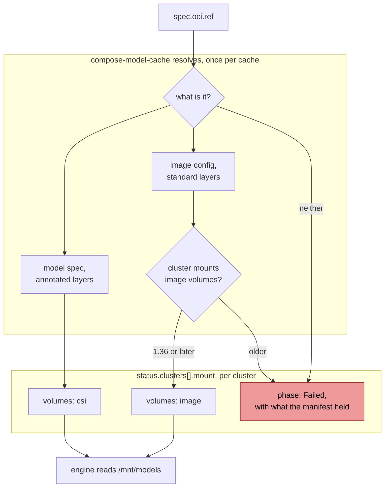

# ModelCache sources and fan-out

**Status:** Draft
**Date:** September 2026
**Author:** Dennis Ramdass
**Supersedes:** [modelplaneai/modelplane#362][362]

## Summary

A `ModelCache` reads from one place and stages to many. Both halves are narrow.
It downloads from HuggingFace into a per-cache ReadWriteMany volume, so a
customer whose models live in their own registry re-uploads to HuggingFace or
does without Modelplane. And it fans out to every matched cluster while
publishing a phase and nothing else, so a consumer works out how to read the
artifact by deriving a volume name that only holds for one source.

This changes both.

**A `ModelCache` reads from an OCI registry.** `source: OCI` names a reference
and the artifact is mounted into the engine's pod where it lies, with per-node
reuse and nothing staged onto a volume first. `source: Existing` mounts a volume
the caller populated, which the same machinery makes almost free.

**Each cluster's entry says how to read the artifact there.**
`status.clusters[].mount` carries the volumes, mounts and environment a consumer
adds to a pod, in Kubernetes' own types. A cluster reports Ready when the
artifact is readable on it and says why when it isn't, so one cluster failing
leaves the others alone and a consumer joins on the entry instead of guessing.

What does the mounting depends on what the artifact is, and the contract is what
keeps that off the consumer. A container image with weights in it is mounted by
Kubernetes as an image volume. A model artifact, which containerd won't mount,
is read by a CSI driver. The `ModelCache` says which it has, in
`spec.oci.artifact`, because getting it wrong is invisible: measured on GKE, a
model artifact mounted as an image volume produces an empty directory, an exit-0
pod and no event anywhere.

## Background

**Weights in a customer's own registry.** Artifact Registry and ECR can't be
named, so a customer who has already solved distribution re-uploads to
HuggingFace to use Modelplane.

**Weights already on a volume.** An air-gapped or regulated fleet often has
them on disk before Modelplane sees them, and no way to say so.

**Reads over NFS.** The volume is ReadWriteMany because a multi-node gang needs
it, which selects Filestore on GKE and EFS on EKS. [modelcache.md][modelcache]
warns this can make a cache slower than no cache.

**The fan-out publishes a phase and keeps the rest to itself.** A cache stages
independently on each matched cluster, propagating a Secret and composing a PVC
and a Job per cluster, and reports `phase` and `message` per cluster with a
`summary.ready` count. How to read what it staged isn't in there.
`compose-model-replica` derives the volume name in `cache_pvc_name`, and
`compose-model-cache` keeps a second copy with a comment telling both to change
together. That derivation is true for one source and for no others.

### Why now

[#406][406] merged on 31 August, closing [#407][407], so a cached engine
command now reads like an uncached one. That put the last piece of how a cache
is read into a second function, by hand.

Image volumes went stable in Kubernetes 1.36, which is what makes an `OCI`
source a field rather than a second hydration path. The measurements are
upstream's: an empirical comparison of model delivery on Kubernetes puts
node-cached OCI delivery at 11.7 seconds to add a warm replica of a 70B-class
artifact, against 40.7 minutes to re-download it from object storage
([arXiv:2607.16596][coldstart]).

## Goals

**Serve a model without moving it.** An `OCI` reference is read where it lives.
An `Existing` volume is the only route a caller has, since the pod template
carries no `volumes`: its container is curated to `image`, `command`, `args`
and `env`, with `imagePullSecrets` the one pod-level field beside it.

**A cluster's entry is the whole answer for that cluster.** Whether the
artifact is readable there, how to read it, and why not if not.

**Keep the surface small.** Each source is an enum value and an object beside
it. A later materializer publishes a different contract instead of adding
another, because the contract is in corev1 types.

Out of scope: naming a cache by the digest of what it holds rather than by the
reference a user wrote, and dropping a second cache that resolves to the same
weights as the first. Both are worth having, and neither is needed to read a
registry. A model catalog, cross-cluster distribution and node-local
materialization are out of scope as well.

## Proposal

### Where a ModelCache reads from

**Changed.** Written by an ML team. `source` gains two values and two siblings.

```yaml
spec:
  required: [source]
  x-kubernetes-validations:            # one per source, as today
  - rule: "self.source != 'OCI' || has(self.oci)"
    message: spec.oci is required when spec.source is OCI.
  properties:
    source:
      enum: [HuggingFace, OCI, Existing]
      description: >-
        Where the artifact comes from. HuggingFace is fetched into a
        Modelplane-managed volume. OCI is mounted from the registry. Existing is
        bring-your-own.
    huggingFace: {}                    # unchanged
    oci:
      required: [ref, artifact]
      properties:
        artifact:
          type: string
          enum: [Image, ModelArtifact]
          description: >-
            What the reference names, which decides how it mounts. No
            default: see "Why this is a field" below.
        ref:
          type: string
          description: >-
            A tag or digest. A private registry's credential is configured
            on the InferenceCluster by the platform team rather than per
            namespace. Prefer a digest: a tag is re-resolved on every pod start,
            so moving it changes what the next pod serves.
        subPath:
          type: string
          description: >-
            Directory within the artifact holding the weights. Defaults to its
            root.
    existing:
      required: [claimName]
      description: >-
        Modelplane mounts the claim and does not populate it. The claim must be
        bound in the serving namespace (default) on every cluster the
        clusterSelector matches, since a pod can only mount a claim in its own
        namespace. That is platform work in a resource an ML team owns, so
        scope the selector to clusters the author knows.
      properties:
        claimName: { type: string }
        subPath: { type: string }
    clusterSelector: {}                # unchanged
```

The kubelet does everything an `OCI` source needs. It pulls the reference when
the pod starts, mounts the filesystem read-only, and serves the second pod on
that node from what the first pulled. Modelplane composes nothing per cluster
for it, which is why the source costs a field rather than a hydration path.

A private reference names no credential on the cache. The HuggingFace token is
propagated per cluster because a Modelplane-composed Job spends it, and there's
no user pod to hang it on. A registry credential is spent by the engine's own
pod, which already takes `imagePullSecrets` for a private engine image.

`sizeGiB` stays required under `HuggingFace` alone, since that is the only
source that puts bytes on a volume Modelplane provisions. An `OCI` mount lands
in the node's image filesystem instead, which limits and later covers. The
`SOURCE` printer column moves to `.spec.source`; it reads
`.spec.source.huggingFace.repo` today, which resolves to nothing against a
string enum.

The engine command still follows the source. A `HuggingFace` cache stages the
hub layout and the contract sets `HF_HUB_CACHE`, so `--model=<repo>` reads the
same cached or not ([#407][407]), where `OCI` and `Existing` hold a model
directory and the engine names `/mnt/models`. The fragment is source-blind; the
argument a user writes follows the artifact.

### Supported, and not

| Source | What you name | Mounted by | Cluster needs |
|---|---|---|---|
| `HuggingFace` | a repository ID | a volume Modelplane stages | a ReadWriteMany class |
| `OCI` | a container image with the weights inside | Kubernetes, as an image volume | 1.36 |
| `OCI` | a model artifact built to the [model spec][modelpack] | the CSI driver | 1.25 |
| `Existing` | a claim you populated | Kubernetes, as a PVC | the claim bound in `default` |

The two `OCI` rows are the modelcar pattern and what `modctl`, [KitOps][kitops]
and `docker model package --format=cncf` produce. A `ModelCache` names which it
has, and the next section says why that is a field rather than something
Modelplane works out.

Not supported, and what to do instead:

| | Why | Instead |
|---|---|---|
| An OCI artifact that is neither kind | An ORAS push of loose files has no image config to unpack by and no `org.cncf.model.filepath` to name files from, so the cluster reports `Failed` with what the manifest held | Add an image config, or repack with `modctl` |
| A model the engine fetches at startup | NVIDIA's NIM downloads its weights from NGC when the container starts, so there is nothing to stage | Let the engine do it; a `ModelCache` isn't involved |
| Per-namespace credentials for a model artifact | The driver authenticates from its own configuration | Publish the model as a container image, which the node pulls as itself |

The user's work is the same whichever kind of artifact it is. The publisher
builds and packages it, since Modelplane serves what a registry already holds.
The platform team sets the registry credential on the `InferenceCluster`, once
per cluster rather than once per namespace. The ML team writes the engine
command, since the contract carries how to reach an artifact and leaves the
naming to them.

### The per-cluster contract

**New field.** `status.clusters[]` already carries one entry per matched cluster
with a phase and a message. It gains `mount`: what a consumer adds to a pod to
read this artifact here, each field a curated subset of the corev1 type of that
name.

```yaml
mount:
  properties:
    volumes: {}          # []corev1.Volume: name, plus one of
                         #   persistentVolumeClaim { claimName, readOnly }
                         #   image                 { reference, pullPolicy }
                         #   csi                   { driver, volumeAttributes }
    volumeMounts: {}     # []corev1.VolumeMount: name, mountPath, subPath, readOnly
    env: {}              # []corev1.EnvVar: name, value
```

A consumer copies these fields without reading them. `cache_mounts` derives the
claim name today, and every source added is another branch inside it; publishing
the fragment moves that branch to the function that already knows the source.
`cache_mounts` returns corev1 `Volume` and `VolumeMount` dicts already, so an
append is what's left of it.

```yaml
# HuggingFace: today's behaviour, published rather than derived
volumes:
- { name: model-cache, persistentVolumeClaim: { claimName: modelcache-ml-team-qwen-7f3a1 } }
volumeMounts:
- { name: model-cache, mountPath: /mnt/models }
env:
- { name: HF_HUB_CACHE, value: /mnt/models }
```

`resource.child_name` appends a hash to every child name, short ones included,
so a published claim carries one. The volume keeps today's `model-cache`, which
leaves pod templates that needn't change alone, and `dshm` is a name a fragment
must never take, since `native.py` composes that itself.

**It carries observations.** The claim or the reference, the path, and whether
the mount is read-only. `readOnly` is the `OCI` entry's load-bearing field and a
fact rather than a choice, since both mechanisms mount the artifact read-only.
`HuggingFace` stays read-write because `HF_HUB_CACHE` is a cache root rather
than a pin: `huggingface_hub` puts its `.locks` inside it, and an engine
fetching a second repository at startup, like kimi-k2's gated tokenizer, writes
there too.

Pod shaping stays with the consumer, so the scratch `emptyDir` and the `HOME`
pointing at it live in `compose-model-replica`, which acts on `readOnly` rather
than being told. `mountPath` and `pullPolicy` are the two conveniences: a
constant the cache repeats so a consumer needn't pair a volume with a path, and
a policy derived from the reference alone.

Reading a fact off another XR's status is established here, since
`InferenceCluster` already publishes `status.cache.storageClassName` for
`ModelCache`, as `Service.status.loadBalancer.ingress` is outside. The privilege
boundary is the schema rather than the spec and status split, since Crossplane's
RBAC manager grants a namespace's edit role the `/status` subresource. It admits
three volume sources and `name`/`value` environment: no `hostPath`, no `secret`,
no `valueFrom`. Whoever writes this status puts a volume and an environment
variable into every engine pod on every cluster the cache matches, so each
widening is a decision. A node-local materializer would want `initContainers`,
which is the next one anybody asks for.

### How an artifact reaches a pod

Each kind takes a fragment of its own, and the contract is what keeps the
difference off the consumer.



**Resolving is the first network call a Modelplane composition function makes,
and it stays small.** `compose-model-cache` fetches the manifest and the config,
two small GETs against the registry the nodes pull from anyway, with the
credential the `InferenceCluster` already holds. It runs per reconcile of the
cache rather than per pod, and `status` records the digest and the kind it
resolved to, so an operator sees what the next pod will mount. A registry it
can't reach leaves the cache `Failed` with the error, which is where an unusable
credential lands too, and the next reconcile retries.

**An image mounts itself.** The kubelet does the reading, and the cluster keeps
the components it already had.

```yaml
volumes:
- { name: model-cache, image: { reference: us-docker.pkg.dev/acme/models/qwen:v1, pullPolicy: Always } }
volumeMounts:
- { name: model-cache, mountPath: /mnt/models, readOnly: true }
```

**A model artifact goes through a driver.** Modelplane installs ModelPack's
[model-csi-driver][csi], which reads the artifact per the model spec and
presents it as a directory. Why a typed artifact mounts empty, below, is why
containerd can't do this itself.

```yaml
volumes:
- name: model-cache
  csi:
    driver: model.csi.modelpack.org
    volumeAttributes:
      model.csi.modelpack.org/reference: us-docker.pkg.dev/acme/models/qwen:v1
volumeMounts:
- { name: model-cache, mountPath: /mnt/models, readOnly: true }
```

`pullPolicy` follows the reference on the image path: `IfNotPresent` for a
digest, `Always` for a tag, so a node that already pulled `:v1` doesn't keep
serving old bytes while a fresh node pulls new ones. `Always` re-resolves the
manifest rather than the layers, so per-node reuse survives.

**Each mechanism covers exactly its own kind.** The driver picks each layer's
output path from `org.cncf.model.filepath` and a codec from its media type, so
it reads a model artifact and passes over a container image; an image volume
unpacks the layer media types containerd knows, which a model artifact lacks.
Both populations are real and the older one is larger, since the empirical study
measures modelcar sidecars and image volumes because those are what people run
([arXiv:2607.16596][coldstart]), while the formats converge on model artifacts.
KServe ships `oci+native://` beside `oci+fetch://` for the same reason.

**What it inspects is the manifest.** One request per cache, with the registry
credential below: an image config whose `rootfs.diff_ids` describe
standard-typed layers takes the image path, a model-spec artifact takes the
driver, and anything else reports `Failed` naming what the manifest held.
Resolving earns its place twice over, because the same request catches a
reference that can't be served at all, which would otherwise arrive as the
silent empty mount below.

**The cluster version gates one path.** Image volumes are stable and on by
default from Kubernetes 1.36, where CSI inline volumes have been generally
available since 1.25, so `InferenceCluster.status.cache` reports `imageVolumes`
and an image on an older cluster reports `Failed` naming the floor. A model
artifact serves there regardless, which is the reasoning behind KServe's second
path as well.

**Each credential sits with the team that owns what it opens.** The ML team owns
the HuggingFace account, so their token stays on the `ModelCache` as
`huggingFace.authSecret` in their namespace. The platform team runs the model
registry, so its credential goes on the `InferenceCluster` beside
`cache.storageClassName`, set once per cluster, and it both resolves the
manifest and backs the driver's pull. An ML team names a model and finds the
credential already in place.

### Why a typed artifact mounts empty

Measured, not inferred. On GKE 1.36.4 with containerd 2.2.6, a `modctl` artifact
mounted as an image volume gave `/mnt/models` with zero files, a pod that exited
0, and no event on the pod or the volume. The same cluster served a real model
the other way: vLLM 0.11.0 on an L4, `--model=/mnt/models` against an `Image`
artifact holding Qwen3-0.6B, weights loaded in 0.45s and a completion answered
over the OpenAI API. The same artifact built with
`--raw=false`, whose layers are tar rather than raw, mounted empty too. A
container image with the same weights mounted 4 files, and the CSI driver read
the artifact and mounted 3.

containerd decides two things separately, and a model artifact fails both
quietly. `images.IsLayerType` matches a descriptor's media type by name against
the `application/vnd.oci.image.layer.` prefix, five Docker schema 2 types and
erofs, so `vnd.cncf.model.weight.v1.tar` is not a layer whatever its bytes hold.
`images.RootFS` then unmarshals the config blob as an OCI image config without
checking the config's own media type, and comes back with nothing. Zero layers
and zero diff IDs agree, the unpack applies nothing, and the volume mounts
empty.

The config misleads, which is worth knowing before someone checks. ModelPack has
`modelfs` where an image config has `rootfs`, and `diffIds` where it has
`diff_ids`, so `ocispec.Image` matches neither. In
`docker.io/ai/glm-5.2:safetensors`, `modelfs.diffIds` is empty in its own right
as well.

| Layer media types | Config lists `rootfs.diff_ids` | What containerd does |
|---|---|---|
| standard | yes | mounts |
| custom | no | zero against zero: empty mount, no error |
| standard | no | `mismatched image rootfs and manifest layers` |
| custom | yes | mismatched the other way |

Row two is where every model packaging format lands, and what both
[containerd#11381][containerd11381] and [kitops#1144][kitops1144] report. Row
three is [containerd#11907][containerd11907]. Row four follows from the same
arithmetic rather than from a report.

Tar layers do not rescue row two, which is worth saying because it looks like
they should. `IsLayerType` matches the media type's *name*, so a
`vnd.cnai.model.weight.v1.tar` layer is not a layer however unpackable its bytes
are, and the `--raw=false` artifact above mounted just as empty as the raw one.

### What this does not catch

An `OCI` cluster reports Ready once it has published how to mount the reference,
not once the reference is known good. Modelplane never reads the registry, so a
typo, a missing tag and an unusable credential all surface at pod start, from the
kubelet or the driver, rather than on the `ModelCache`. That is the cost of not
resolving, and it is worth stating next to the field that follows from the same
decision.

It is a smaller cost than it looks, because every one of those failures is loud.
Measured on the same cluster: a wrong platform gives `no match for platform in
manifest`, a missing tag gives `not found`, and a private reference without a
credential gives a 403 on the pull. The engine never starts and the pod says why.
The silent case is the one the field prevents.

An `Existing` cluster is different, and does catch it: the claim is observed
rather than assumed, so a cache whose claim is missing or unbound stays Pending
and publishes no fragment. It can, because a claim is a Kubernetes object the
control plane can already see; a registry is not.

### Why this is a field

`spec.oci.artifact` is required, with no default, and that follows from the
measurement. Modelplane could resolve the reference and work out which kind it
has, and an earlier shape of this design did exactly that. Two things argue
against starting there.

It would be the first network call in a composition path, which is a larger
change to how functions behave than this document should smuggle in.

More importantly, a wrong answer is invisible. Every other way of getting this
wrong announces itself: a bad reference fails the pull, a missing credential
fails the pull, an unreadable artifact fails the driver. Mounting a model
artifact as an image volume succeeds, and the first sign is an engine that
cannot find weights on a mount that is present and empty. Where a wrong guess is
silent, asking is better than inferring, and a user who publishes the artifact
knows which kind they built.

Resolution stays available as a convenience later: it would fill the field in
rather than replace it, and a filled field can be checked against the manifest
instead of trusted.

[containerd#11381][containerd11381] would close this and isn't close itself: its
maintainers asked for a KEP and OCI spec coordination first, because an artifact
has no defined rootfs mapping the way an image does. CRI-O shipped the narrow
version by declining to treat an artifact as a rootfs at all, which gives #11381
a design to point at rather than an answer to the objection.

### What a live run showed

The contract above is not only unit-tested. On a control plane running this
branch, against a GKE cluster registered with `source: Existing`:

```
ModelCache/qwen-oci  status.clusters[0]:
  name: gke-oci
  phase: Ready
  mount:
    volumes:      [{name: model-cache, image: {reference: .../qwen3-06b:v2, pullPolicy: Always}}]
    volumeMounts: [{name: model-cache, mountPath: /mnt/models, readOnly: true, subPath: models}]
    env:          []
```

and the `ModelReplica` that `compose-model-deployment` composed for that cluster
carried the same fragment on `spec.mount`, which became the engine pod's
`volumes[]`. The join is the contract working: the cache decided, the deployment
copied this cluster's entry, and the replica mounted what it was handed without
deriving anything.

Before that, the cache reported `NoClusters` while none matched.

The other two sources were run the same way. `artifact: ModelArtifact` against a
GHCR reference composed the driver volume rather than an image volume, which is
the branch the required field exists to choose:

```yaml
volumes: [{name: model-cache, csi: {driver: model.csi.modelpack.org,
           volumeAttributes: {model.csi.modelpack.org/reference: ghcr.io/…/qwen3-06b-artifact:v1}}}]
```

`source: Existing` was run against a claim created after the cache. It reported
`Pending` with no fragment while the claim was absent, and `Ready` with the
claim's fragment once it bound, which is the behaviour the Observe-only Object
exists to produce.

`InferenceCluster.spec.modelRegistryAuthSecret` reached the CSI driver's Helm
release as a `valuesFrom` reference rather than a value: the release's own stored
values carry `config.registryAuths`, resolved by provider-helm from the Secret,
and no composed resource holds the credential.

One operational note falls out of that. provider-helm reports the release
`Synced` without noticing that a referenced Secret's *contents* changed, so
adding or rotating a registry credential does not reach the driver until
something else forces an upgrade. Worth saying next to the field rather than
discovering during an incident.

### Fan-out

A cluster's entry becomes the whole answer for that cluster: whether the
artifact is readable there, how to read it, and why not if not. `phase` and
`message` already say the first and third for a `HuggingFace` source that is
staging or has failed. `mount` says the second, and two more failures become
sayable.

`InferenceCluster.status.cache` gains `imageVolumes`, a boolean saying whether
this cluster can mount one. It follows `status.cache.storageClassName`, which
exists so `ModelCache` can target the cache PVC without reaching into the
cluster XRs: `compose-inference-cluster` derives it from the provisioned
cluster's version, and reads it from `spec.cluster.existing.cache` for a cluster
Modelplane didn't build and can't inspect.

It gates one artifact class rather than the source. A model artifact takes the
driver and doesn't care; a standard image on a cluster below 1.36 reports
`Failed` naming the floor. That distinction is worth having, because the
providers disagree about what's current: Modelplane defaults to 1.36 for EKS and
`v1.36.2+1` for Vultr, while GKE's Regular channel still defaults to 1.35 and
AKS and Nebius sit at 1.34 here. Raising those defaults is a separate decision,
and a smaller one now that only one path waits on it.

A cluster whose XR hasn't reported yet is `Pending`. An `Existing` cache whose
claim isn't bound on that cluster reports `Failed`, and either failure stays on
its own cluster: the others keep their entries, and `summary.ready` counts what
it always counted.

The cluster name stops being an argument threaded through a hydration
lifecycle. Each entry is derived from that cluster's own observed resources,
and the per-cluster PVC, Job and Secret key off the same name, which is a
refactor rather than an API change.

### Reading it

`compose-model-replica` requires the `ModelCache`, finds its own cluster's
entry, prepends `env` and appends the rest. Env leads because `native.py`
already puts Modelplane's entries first "so the user's can reference them",
which also leaves a user's own `HF_HUB_CACHE` or `HOME` as the last word.

A read-only mount is the one entry it acts on rather than copies. Engines write
tokenizer, compile and lock artifacts beside the weights, so where the model's
`volumeMounts` entry is `readOnly` the function adds an `emptyDir` and points
`HOME` at it, which sends `~/.cache` there and takes HuggingFace, vLLM and
Triton with it. `HOME` rather than `VLLM_CACHE_ROOT` and its siblings, because
naming an engine's variables would break the opacity this design keeps, and it
carries a `sizeLimit` because a `torch.compile` cache runs to gigabytes on a
node's ephemeral disk and an unbounded `emptyDir` evicts the pod rather than
failing the write.

It blocks with a condition when its cluster has no entry, or an entry with no
`mount`. [#186][186] fixed the neighbouring failure: `compose-model-deployment`
intersects the cache's `clusterSelector` with the deployment's, so a replica
can't land outside the cache's footprint. Labels can't express a cluster inside
that footprint that hasn't finished staging, or has failed, or never had its
`Existing` claim created, or can't mount an image. Each of those is a pod stuck
on a volume, with the cache reporting the trouble where the pod's owner won't
see it.

`cache_pvc_name` has a caller besides `cache_mounts`, which uses its output as
a per-cache identity rather than as a storage name. That value is derived from
the cache's namespace and name and survives under a name of its own; the helper
doesn't.

## Limitations

**A cache reports what it can check, which is most of it.** Resolving the
reference makes a missing repository, an unusable credential and an artifact of
no recognised shape all `Failed` with a reason. What survives resolution is
whether the artifact holds the model anyone meant, and whether an `Existing`
volume was filled completely; both report Ready and fail at engine start.
`HuggingFace` is the one source Modelplane stages itself and so the one it can
vouch for.

**An `OCI` mount spends node disk, and which disk depends on the mechanism.**
The driver caches artifacts under its own `rootDir`, `/var/lib/model-csi` by
default, where an image volume lands in the image store and counts against
`imagefs` eviction thresholds. Neither is sized by `sizeGiB`, both give per-node
reuse, and a model larger than the node's disk fails at pod start either way.
Size the pool's disk for the largest model it serves, and know which filesystem
is filling before debugging the wrong one.

**The driver costs a component, and a private model artifact costs a
credential.** A DaemonSet in the pull path is a thing to install, upgrade and be
broken by, and the project is young and quiet, with no commit since March 2026.
Modelplane installs it with the rest of the serving stack, on every cluster,
since a composition function sees one cluster rather than the fleet's caches and
can't tell in advance which artifacts land there. A fleet that publishes images
pays neither cost: the DaemonSet idles and its `registryAuths` stays empty.

The credential is the sharper half, and it is worse than "no per-volume secret".
Measured on GKE: the kubelet pulled a private Artifact Registry image using the
node's Workload Identity, and the driver, given the same reference, made an
**unauthenticated** request and took a 403. It does not fall back to the node's
identity at all. So every private model artifact needs a long-lived credential in
the chart's `registryAuths`, where the image path needs none.

**Installing the driver on GKE takes three fixes that its chart doesn't ship.**
Also measured, in this order: its DaemonSet runs at `system-node-critical`, which
GKE admits only in a namespace carrying a `gcp-critical-pods` ResourceQuota, so
pod creation is rejected with `FailedCreate` and nothing explains why. This is
the same failure Modelplane already hit with the NVIDIA DRA driver
([#202][202]), and `compose-serving-stack` already composes an
`allow-critical-pods` quota for it: installing the driver means composing the
same quota into its namespace. Then the chart's default image is
`model-csi-driver:latest`, with no registry, which resolves to Docker Hub and
does not exist. Then its registrar sidecar is pinned to `k8s.gcr.io`, frozen
since 2023. After all three it runs, and mounts.

**On CRI-O the driver is redundant, and this doesn't exploit that.** CRI-O has
mounted model artifacts natively since v1.33 ([cri-o#9131][crio9131]), so an
OpenShift cluster could take one path for both kinds. Skipping the driver there
costs a second thing for a cluster to report and a second branch to test, for
the one kind of cluster Modelplane never provisions. So CRI-O takes the driver
path with everything else, until containerd closes the gap, which is the day the
driver stops earning its place anywhere.

## Later

**Node-local materialization.** An init container copying the artifact to the
node, publishing a `hostPath` and the `initContainers` that fill it. It removes
the NFS read ceiling for `HuggingFace`, and holds every model on every node
that might serve it, so it wants size limits and eviction first. Both `OCI`
mechanisms already give per-node reuse, on the same terms.

**Accelerating the HuggingFace fetch.** The Job downloads over HTTPS rather
than through a container runtime, so pointing it at a proxy means environment,
annotations and volumes on the Job. That is what a user behind a corporate
proxy needs, or one mounting a private CA bundle, and it lands when a user has
that problem.

## Alternatives considered

**A `ModelCacheHydration` child.** [#362][362] proposes one, because
`ModelCache` runs every cluster's hydration lifecycle in one function and is the
only fan-out
not following `ModelDeployment` to `ModelReplica`. I proposed it, and this
supersedes it: the contract needs somewhere per cluster to live and
`status.clusters[]` is already there, while a child would compose only a status
field for `OCI` and `Existing`. The complaint underneath is how one function is
organised, which the refactor in fan-out addresses without an API to maintain.

**A `source: ModelPack` value.** Both mechanisms read the artifact without being
told, so the value would describe the publisher's build rather than anything
Modelplane does. It would also outlive its reason, since
[containerd#11381][containerd11381] or [kitops#1144][kitops1144] landing leaves
an enum value that means nothing and can't be removed.

**A ModelPack hydration Job.** Pull with `modctl` and stage onto the cache's RWX
volume, the way `HuggingFace` is staged. Proven on GKE at 953MiB in 9.8s for
Qwen2.5-0.5B-Instruct, and it copies every byte to do what the driver does by
mounting the artifact where it lies.

**A discriminated union for the mount volume.** `status.mount.volume` with a
`kind`, so a consumer switches rather than probes. It reads like the right shape
and does the opposite: the consumer would translate the union back into a corev1
volume, one case per kind, and every new materializer adds another.

**An OCI reference on the `ModelDeployment`.** For `OCI` and `Existing` a
`ModelCache` caches nothing, so the engine's spec could carry the reference. The
pod template has no `volumes` to fill, so this needs a new engine field either
way, and it splits where a user says where their model lives.

[modelcache]: https://github.com/modelplaneai/modelplane/blob/main/design/modelcache.md
[modelpack]: https://modelpack.org/
[kitops]: https://kitops.org/docs/modelkit/intro/
[containerd11381]: https://github.com/containerd/containerd/issues/11381
[containerd11907]: https://github.com/containerd/containerd/issues/11907
[coldstart]: https://arxiv.org/abs/2607.16596
[crio9131]: https://github.com/cri-o/cri-o/pull/9131
[csi]: https://github.com/modelpack/model-csi-driver
[202]: https://github.com/modelplaneai/modelplane/issues/202
[kitops1144]: https://github.com/kitops-ml/kitops/issues/1144
[186]: https://github.com/modelplaneai/modelplane/issues/186
[362]: https://github.com/modelplaneai/modelplane/pull/362
[406]: https://github.com/modelplaneai/modelplane/pull/406
[407]: https://github.com/modelplaneai/modelplane/issues/407
